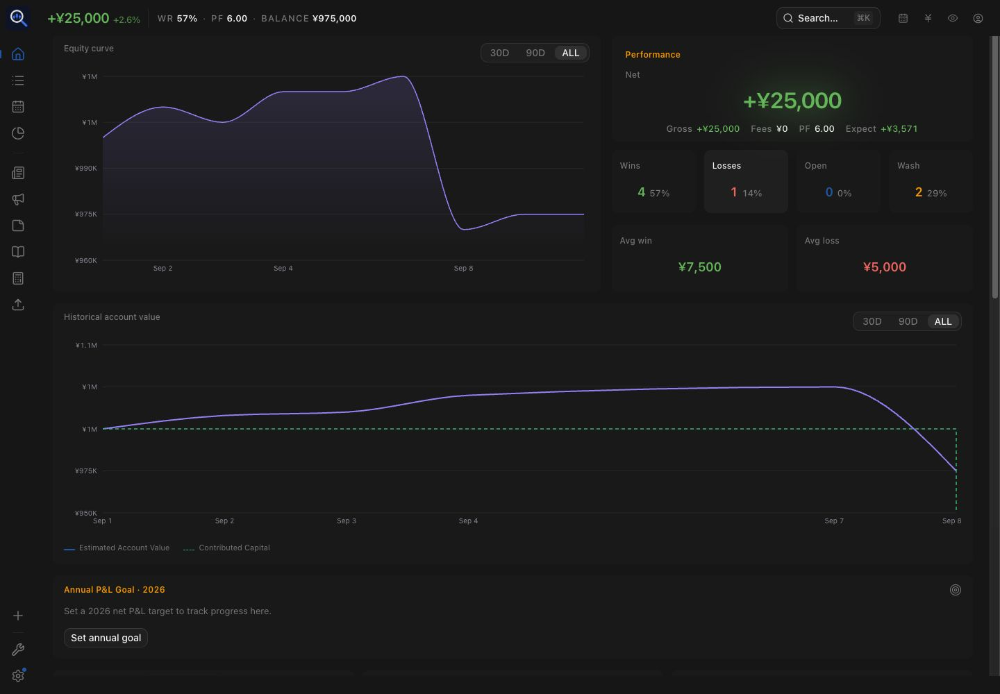
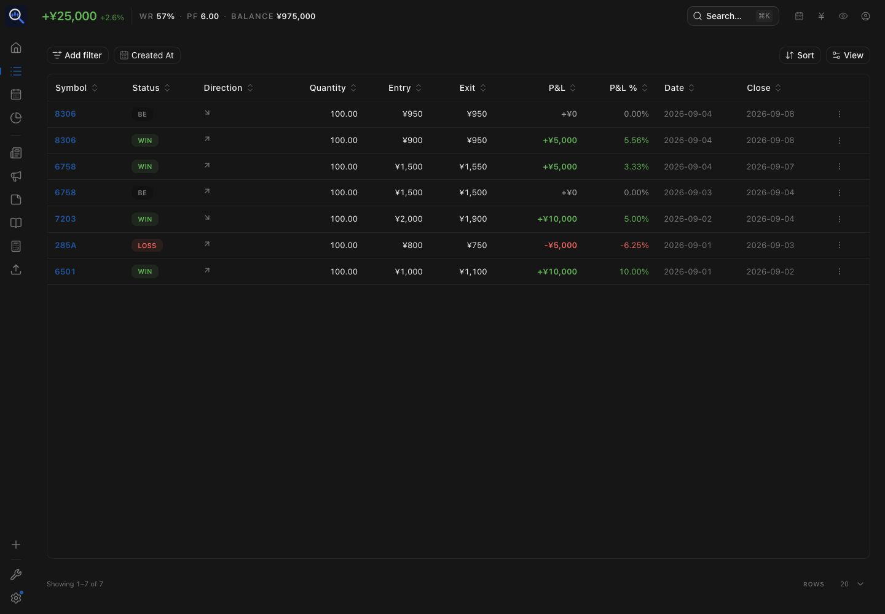
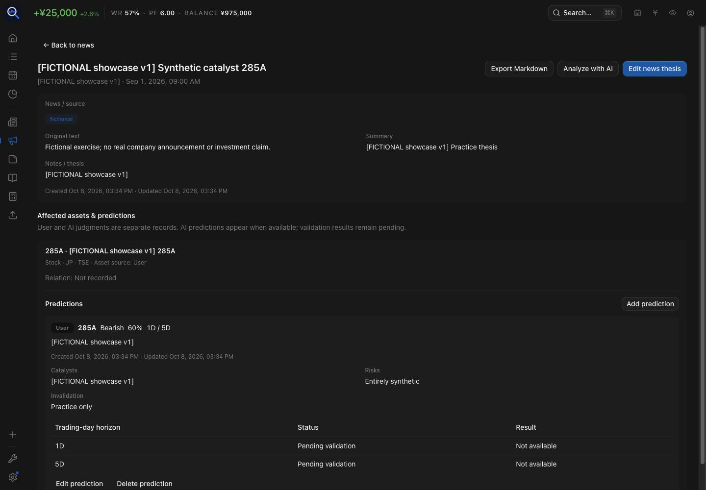
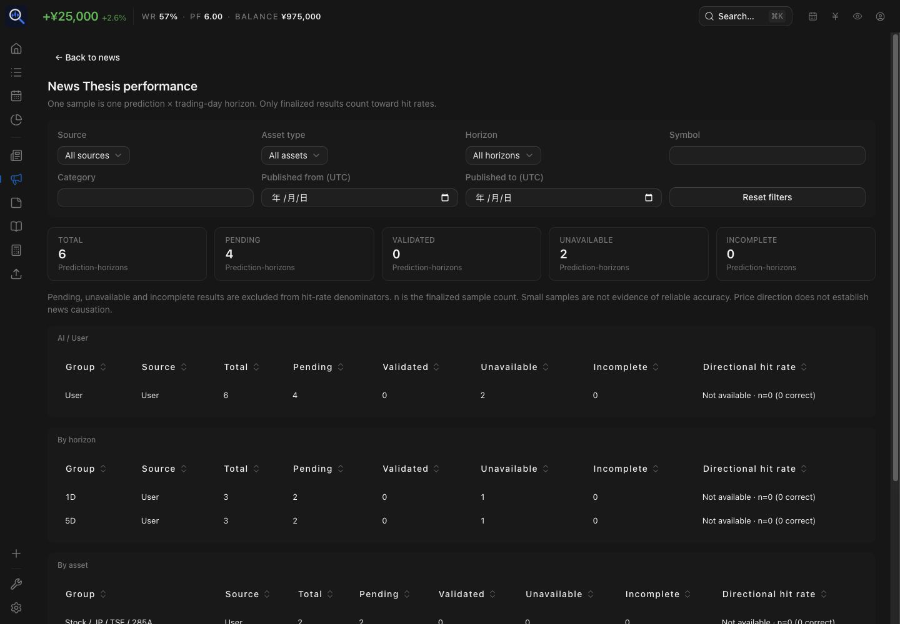
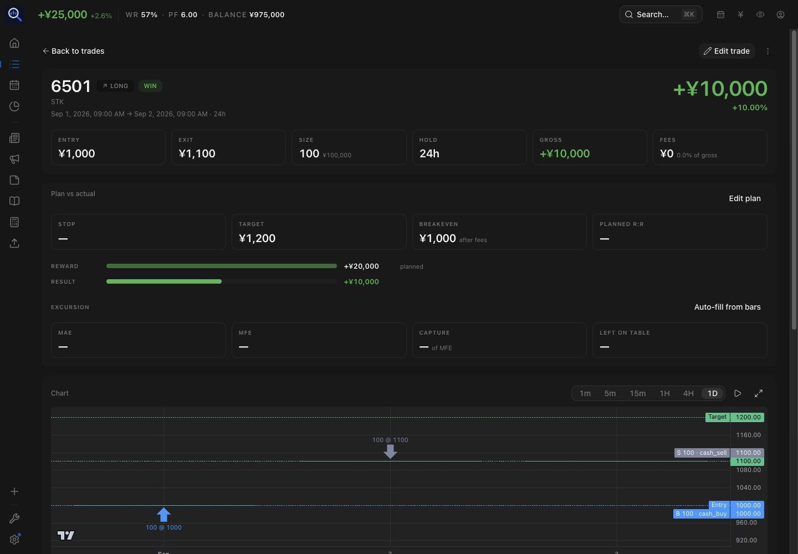

<div align="center">


# TradeLens

### Record. Review. Improve.

**Japanese-equity review and news-thesis research, on your own server.** Import SBI
execution and yen cash history, keep cash and margin positions distinct, review historical
account-value estimates, and compare planned trades with actual fills. Record news theses
and predictions, then inspect persisted validation evidence when market data is available.

Built on [TraderMemos](https://github.com/sinhong2011/TraderMemos) by
[sinhong2011](https://github.com/sinhong2011) and contributors. TradeLens extends that
journal and analytics foundation; it is not a hosted service or brokerage connection.

The Web application is the active product. The existing Expo mobile client is preserved but is outside active fork validation.

TradeLens retains the original project’s AGPL-3.0 license and attribution; see [NOTICE](NOTICE) and [fork development policy](docs/FORK_DEVELOPMENT.md).

<br/>

[](https://github.com/HoesenBruce/TradeLens/releases) [](https://github.com/HoesenBruce/TradeLens/actions/workflows/web-ci.yml) [](LICENSE)

[](api/go.mod) [](web/) [](api/) [](docs/fork-deploy.md)

<br/>

[Quick start](#quick-start) · [SBI guide](docs/features/sbi-import.md) · [News research](docs/features/news-predictions.md) · [Synthetic showcase](docs/showcase-demo.md) · [Docs](#docs) · [Upstream credits](#license)

</div>

## A look inside

Actual production-build Web captures using a **fictional JPY showcase**, not real trading
performance. Prices, news and returns are synthetic; [reproduction and limitations](docs/screenshots/README.md).



<table>
<tr>
<td width="50%"><p>Japanese trade log · <a href="docs/features/sbi-import.md">SBI import guide</a></p></td>
<td width="50%"><p>News thesis · <a href="docs/features/news-predictions.md">Research workflow</a></p></td>
</tr>
<tr>
<td width="50%"><p>Prediction evidence · <a href="docs/features/prediction-validation.md">Validation requirements</a></p></td>
<td width="50%"><p>Plan versus actual fills</p></td>
</tr>
</table>

The showcase has no scored predictions: pending/unavailable outcomes are shown honestly.
Detailed cash-flow, SBI guidance and manual-editor images are in the feature guides.
Mobile remains outside active fork validation; new captures are required before mobile publication.

---

## TradeLens extensions and TraderMemos foundation

| TradeLens extension | What you can review | Guide |
| --- | --- | --- |
| **SBI and Japanese equities** | Execution-history, yen cash-statement and realized-P&L CSVs; separate cash, margin-long/short, 現引 and 現渡 semantics. Rules are SBI-specific. | [SBI import](docs/features/sbi-import.md) |
| **News thesis and predictions** | Link news to assets; save User predictions or explicitly accept optional AI suggestions; inspect pending, unavailable, incomplete and validated horizon evidence. Validation is API-driven, not automatic news collection. | [Research](docs/features/news-predictions.md) · [Validation](docs/features/prediction-validation.md) |
| **Historical valuation and currency-aware review** | Replay positions and cash against available market data. Mixed-currency review uses **latest FX**, including for historical values; it does not reconstruct historical FX returns. Missing history or prices can leave estimates incomplete. | [Metrics](docs/features/analytics-metrics.md) · [Market-data contract](api/internal/marketdata/) |
| **Planned versus actual review** | Keep planned direction separate from execution direction and compare targets with actual exits, fills and journal notes. | [Synthetic worked example](docs/showcase-demo.md#expected-results-and-audit) |

**TraderMemos supplies the foundation:** trade journaling/grouping, the P&L calendar,
generic analytics, Playbook, replay/paper accounts, risk tools, sharing, AI coaching and
provider integrations. TradeLens retains and extends these capabilities rather than
claiming them as original fork features. Existing stops/targets and risk tools also come
from upstream. See [NOTICE](NOTICE) and the [fork/accounting policy](docs/FORK_DEVELOPMENT.md).

TradeLens additionally extends Generic Bars v1 HTTP routing/source metadata and Web
localization. Provider coverage is not guaranteed; a collector is a separate service.
AI requires your own OpenAI-compatible provider/key and explicit acceptance of news
suggestions. The Web is active; retained mobile contracts are not proof of mobile validation.

## Roadmap & validation scope

The following are tracked separately and are **not delivered features**:

- [Custom statistics dashboard](https://github.com/HoesenBruce/TradeLens/issues/10), [multi-account review workflow](https://github.com/HoesenBruce/TradeLens/issues/9), and [actual/virtual account comparison](https://github.com/HoesenBruce/TradeLens/issues/8) remain open for specification. Current account aggregation does not deliver these workflows.

The Generic Bars HTTP integration is implemented; operating a separate intraday collector and verifying its data coverage is a separate deployment task. News research and evaluation are implemented as described above, not a promise of automated news collection or a general event backtesting system.

Mobile is preserved from upstream and **not validated for this fork**. Reactivation requires compatibility and platform testing; see the [fork development policy](docs/FORK_DEVELOPMENT.md). Inherited upstream features may not all receive the same level of validation as active Web workflows.

## Quick start

Web UI and API in one Compose stack, on your own machine:

```bash
git clone https://github.com/HoesenBruce/TradeLens.git
cd TradeLens
cp .env.example .env   # review JWT secret and pin TM_IMAGE_TAG
make up          # → http://localhost:3000
```

> **Current TradeLens status:** official TradeLens GHCR images are published. `make up` (SQLite) and `make up-postgres` (PostgreSQL) use them by default. Source-build fallback remains available through `make up-build` / `make up-postgres-build`. Docker publishing is currently `disabled_manually`; Release Please is enabled. Image availability does not imply continuous image publishing is enabled.
>
> **Database boundary:** TradeLens and upstream TraderMemos migration histories have diverged. Never hand a database used by one product to the other, including PostgreSQL. Use separate projects and fresh databases for different products. Switching an existing TradeLens source deployment to official TradeLens images is a same-product deployment change: take a complete backup, then preserve the checkout, Compose project, configuration and volumes.

`make up` uses official TradeLens GHCR images; `make up-build` builds this checkout. Set `TM_IMAGE_REGISTRY` / `TM_IMAGE_TAG` in `.env`; pin a stable version in production (example: `0.2.1`). Without a tag setting, `latest` moves with stable releases. The local stack serves Web and `/api` on one origin, so leave **Server** blank. First visit creates the owner through the setup wizard.

<details>
<summary><strong>Options and production notes</strong></summary>

<br/>

```bash
cp .env.example .env   # review JWT secret, TM_IMAGE_REGISTRY, TM_IMAGE_TAG
make up                # official TradeLens GHCR images (SQLite)
make up-postgres       # official images with PostgreSQL
```

For production, set `TM_JWT_SECRET=$(openssl rand -hex 32)` and put TLS (Caddy/Traefik) in front — see [docs/deploy.md](docs/deploy.md).

Full-instance backups require **SQLite database + attachments**, or **PostgreSQL dump + attachments**, with deployment configuration/secrets retained securely. Account ZIP and research Markdown exports are not complete instance backups. See [backup and restore](marketing/content/docs/self-hosting/backup-restore.mdx).

Prefer Postgres over the default SQLite? `make up-postgres` runs the same stack with a Postgres overlay.

</details>

## Deploy on your cloud account

Vercel, Cloudflare and Netlify can host the Web SPA; the API needs its own host and
persistent database/attachments (for example Railway with a `/data` volume).
Configure CORS and the login **Server** or build-time `VITE_API` for split origins.
These are deployments on your account, not official hosted TradeLens services.
Use the [fork deployment guide](docs/fork-deploy.md) for buttons and configuration.

## Mobile status

The Expo client is preserved from TraderMemos, outside active TradeLens validation.
[Upstream mobile releases](https://github.com/sinhong2011/TraderMemos/releases/latest)
and its TestFlight distribution are **upstream-only**, not official TradeLens applications.
Compatibility with this fork is unverified. See [mobile source instructions](mobile/README.md).

## Development

```bash
git clone https://github.com/HoesenBruce/TradeLens.git
cd TradeLens
make setup && make dev   # API :8080 + web :5173
```

See [CONTRIBUTING.md](CONTRIBUTING.md) for targets, Vite+ commands, and project structure.

### Synthetic TradeLens showcase

Use a **fresh disposable API database and user**, separate from any real portfolio.
Follow [showcase setup](docs/showcase-demo.md) to start the local synthetic Generic Bars
provider and API, create the fictional user without an account, then run:

```bash
python3 scripts/seed-demo.py --mode showcase \
  --api http://127.0.0.1:8093/api/v1 \
  --email fictional@example.com --password fictional-showcase-password
```

These public APIs import 12 fictional SBI rows into 14 executions / seven closed groups:
JPY 25,000 P&L, 950,000 contributed capital and 975,000 account value. The three invented
news theses have six prediction horizons: four pending and two unavailable, **zero scored**.
No real prices, news, credentials or AI provider are required. Save timestamps cannot be
backdated through supported APIs. The whole seed refuses reruns; reset with a new database.

For the optional legacy USD generator, see `python3 scripts/seed-demo.py --help`
(`--mode legacy`, the default). The separate [upstream demo book](docs/demo/) and
[upstream hosted demo](#upstream-live-demo) illustrate TraderMemos, not TradeLens extensions.

## Docs

Start with the fork guides below. The inherited marketing/docs sources are in [marketing/](marketing/). Upstream user docs (which may differ from this fork) live on the upstream site: **[trader-memos.vercel.app](https://trader-memos.vercel.app)** — getting started, importing trades, supported brokers, self-hosting guides, FAQ, and the full API reference.

| Doc | Topic |
|-----|--------|
| [SBI import](docs/features/sbi-import.md) | Japanese CSVs, cash/margin and settlement limits |
| [News research](docs/features/news-predictions.md) | Manual and optional AI predictions |
| [Prediction validation](docs/features/prediction-validation.md) | Evidence, trading-day eligibility and report interpretation |
| [Synthetic showcase](docs/showcase-demo.md) | Disposable setup and reproducible expected results |
| [docs/features/analytics-metrics.md](docs/features/analytics-metrics.md) | Analytics formulas, sample rules, units, and edge cases |
| [docs/fork-deploy.md](docs/fork-deploy.md) | One-click / fork → Vercel, Cloudflare, Netlify, Railway |
| [docs/deploy.md](docs/deploy.md) | Docker, CORS, edge rewrite |
| [docs/tm-sync.md](docs/tm-sync.md) | The tm-sync local statement watcher |
| [docs/release.md](docs/release.md) | Versioning, changelogs, GitHub Releases |
| [CONTRIBUTING.md](CONTRIBUTING.md) | Local dev (`make dev`) |
| [DESIGN.md](DESIGN.md) | UI system — shadcn/ui + coss ui tokens |

## Tech stack

| Layer | Stack |
|-------|-------|
| **API** | Go · Echo · sqlc · golang-migrate · SQLite / Postgres |
| **Web** | React · Vite+ · TanStack Router/Query/Form · Tailwind |
| **Mobile** | Expo (iOS & Android) · PanelUI + Uniwind (Tailwind) · iOS extras: WidgetKit / Live Activities / App Intents |
| **Sync agent** | [tm-sync](docs/tm-sync.md) — a Go binary that watches statement folders and imports on change |
| **Design** | shadcn/ui + coss ui tokens — see [DESIGN.md](DESIGN.md) |

## Upstream live demo

Try the original TraderMemos (not a TradeLens deployment) without installing anything: **[tradermemos.netlify.app](https://tradermemos.netlify.app)**

Sign in with `tradermemosdemo` / `demopassword`. The demo account carries a seeded dataset — treat it as a shared sandbox, and don't store anything real in it.

If TraderMemos is part of your daily review, consider [sponsoring its development](https://github.com/sponsors/sinhong2011) — it keeps the project free and self-hosted for everyone.

## Star history

### TradeLens

<div align="center">
<a href="https://www.star-history.com/#HoesenBruce/TradeLens&Date">
  <picture>
    <source media="(prefers-color-scheme: dark)" srcset="https://api.star-history.com/svg?repos=HoesenBruce/TradeLens&type=Date&theme=dark" />
    <source media="(prefers-color-scheme: light)" srcset="https://api.star-history.com/svg?repos=HoesenBruce/TradeLens&type=Date" />
    
  </picture>
</a>
</div>

TradeLens is based on [TraderMemos](https://github.com/sinhong2011/TraderMemos).
[View upstream TraderMemos star history](https://www.star-history.com/#sinhong2011/TraderMemos&Date).

<!-- Verify chart rendering after TradeLens becomes public; private-repository history may be unavailable. -->

## License

TradeLens is based on [TraderMemos](https://github.com/sinhong2011/TraderMemos), originally developed by [sinhong2011](https://github.com/sinhong2011) and contributors.

TradeLens is distributed under the GNU AGPL-3.0. See [LICENSE](LICENSE) for the full license terms and [NOTICE](NOTICE) for attribution.

See [THIRD_PARTY_NOTICES.md](THIRD_PARTY_NOTICES.md) for copied-component licenses,
font distribution notices and external ReUI development-resource guidance.
