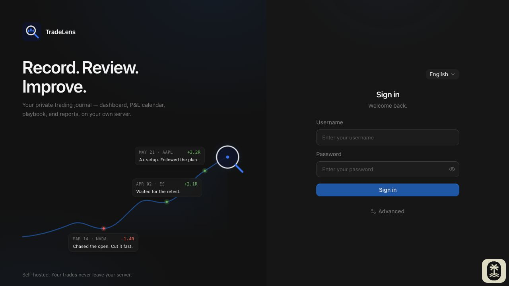
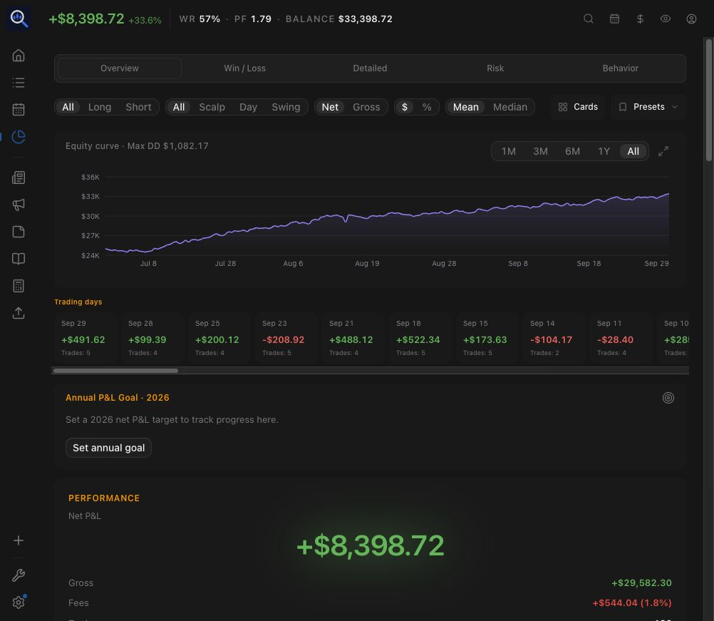
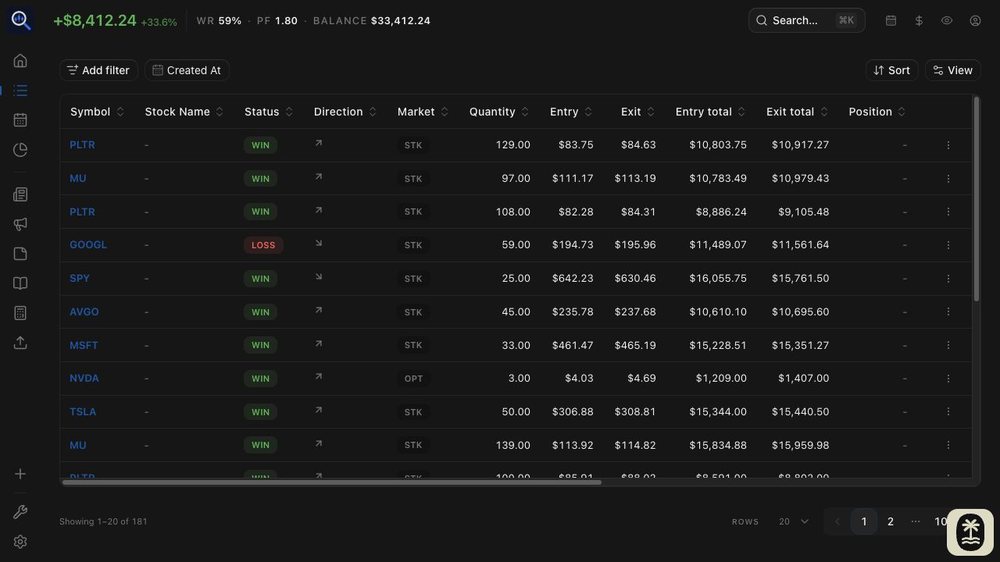
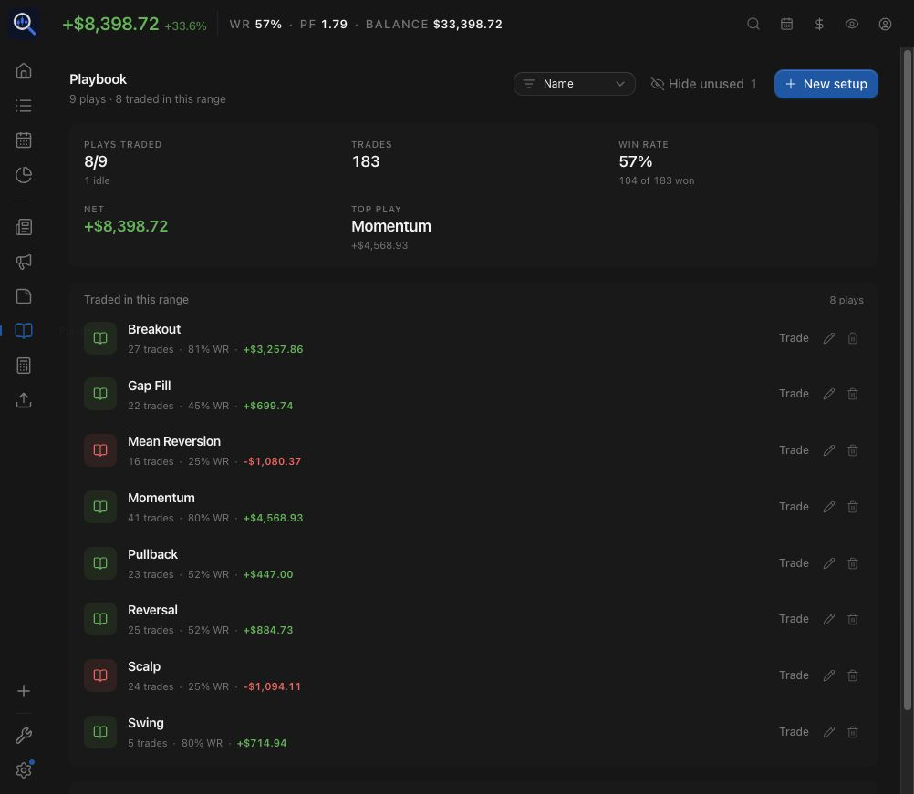

<div align="center">


# TradeLens

### Record. Review. Improve.

**A self-hosted trading journal, portfolio analytics, and trading research platform** for recording trades, reviewing performance, and testing market theses. Built on [TraderMemos](https://github.com/sinhong2011/TraderMemos) by [sinhong2011](https://github.com/sinhong2011) and contributors, TradeLens extends broker imports, account valuation, market-data access, research workflows, and Web localization.

The Web application is the active product. The existing Expo mobile client is preserved but is outside active fork validation.

TradeLens retains the original project’s AGPL-3.0 license and attribution; see [NOTICE](NOTICE) and [fork development policy](docs/FORK_DEVELOPMENT.md).

<br/>

[](https://github.com/HoesenBruce/TradeLens/releases) [](https://github.com/HoesenBruce/TradeLens/actions/workflows/web-ci.yml) [](LICENSE)

[](api/go.mod) [](web/) [](api/) [](docs/fork-deploy.md)

<br/>

[](https://vercel.com/new/clone?repository-url=https%3A%2F%2Fgithub.com%2FHoesenBruce%2FTradeLens&root-directory=web&project-name=tradelens&repository-name=tradelens&env=VITE_API&envDescription=Optional%20API%20base%20URL%20(e.g.%20https%3A%2F%2Fapi.example.com%2Fapi%2Fv1).%20Leave%20empty%20to%20set%20Server%20at%20login.&envLink=https%3A%2F%2Fgithub.com%2FHoesenBruce%2FTradeLens%2Fblob%2Fmain%2Fdocs%2Ffork-deploy.md) [](https://deploy.workers.cloudflare.com/?url=https%3A%2F%2Fgithub.com%2FHoesenBruce%2FTradeLens%2Ftree%2Fmain%2Fweb) [](https://app.netlify.com/start/deploy?repository=https://github.com/HoesenBruce/TradeLens) [](https://railway.com/new/template?template=https%3A%2F%2Fgithub.com%2FHoesenBruce%2FTradeLens&utm_medium=integration&utm_source=button&utm_campaign=tradelens)

<br/>

[Quick start](#quick-start) · [Mobile app](#mobile-app) · [Upstream docs](https://trader-memos.vercel.app) · [Fork guide](docs/fork-deploy.md) · [Contributing](CONTRIBUTING.md) · [Design](DESIGN.md) · [License](LICENSE)

<br/>



</div>

## A look inside



<table>
<tr>
<td width="50%"><p align="center"><strong>Trade log</strong></p></td>
<td width="50%"><p align="center"><strong>Playbook</strong></p></td>
</tr>
</table>

Screenshots show the English TradeLens Web interface on a local instance. Trading results are generated demo data from `scripts/seed-demo.py`, not real trading performance.
Capture inputs and retained-image provenance are recorded in [the screenshot manifest](docs/screenshots/README.md). Old mobile/store captures were removed; new captures are required before mobile publication.

---

## Why TradeLens?

TradeLens keeps your trading journal and portfolio analytics on your own infrastructure. You control the database, configure your own OpenAI-compatible API for optional AI features, and can extend the application from source.

## Features

These capabilities are available on the current `main` branch. Core journaling, reports, replay, and sharing build on TraderMemos; the next section describes this fork's extensions. Market-data features depend on provider coverage, and AI features require your own configured OpenAI-compatible API.

| Capability | What you can do |
|---|---|
| **Trading Journal** | Record or import fills, group them into trades, filter and tag your journal, attach screenshots, and review execution detail and MAE/MFE when intraday bars are available. Keep trade plans, planned direction, stops, and targets alongside actual fills and review notes. Import broker CSVs, MT4/MT5 statements, or IBKR Flex trade data; use [tm-sync](docs/tm-sync.md) to watch statement folders. |
| **Portfolio & Performance** | Review one account or a selected account group through Home statistics, equity curves, the P&L calendar, account-value estimates, and annual goals. Analyze expectancy, SQN, Kelly %, Monte Carlo, execution quality, and setup/session breakdowns; manage cash flows and risk/prop alerts. Mixed-currency analytics require a target currency and use **latest FX**, including when displaying historical values; they do not reconstruct historical FX returns. |
| **Japanese Broker Support** | Import SBI Securities execution, yen cash-statement, and domestic-stock realized P&L CSVs. Review cash and margin-long/short trades, 現引 (margin-to-cash conversion), and 現渡 (delivery settlement), with broker-specific accounting and warnings where split or valuation evidence is incomplete. |
| **Market Data** | Use Yahoo or Finnhub bars, or connect a local/self-hosted service implementing the Generic Bars v1 HTTP contract. Configure provider order and fallback for supported responses. Feed charts, excursion analysis, replay, valuation, and prediction evaluation with available bars; inspect split-related events and data limitations. |
| **Trading Research** | Build a Playbook linked to trades and review rule compliance. Replay available bars with a persistent paper account. Record news theses, affected assets, and User/AI predictions; review optional AI suggestions before saving and export news records as Markdown. Prediction-validation APIs evaluate trading-day horizons and optional benchmark/excess returns; the News performance page summarizes stored evaluations. |
| **User Experience** | Choose English, 中文, or 日本語 before sign-in, then use localized Web workflows in English, Simplified Chinese, and Japanese (with upstream Traditional Chinese and Korean retained). Review trades in dark or light themes and use position-size, FX, and Kelly tools. Share cards and Year Wrapped recaps, or enable revocable read-only performance links. Optional AI supports screenshot fill extraction and trade coaching; personal API tokens support scripts/MCP, with OpenAPI docs at `/docs`. |

## Extended from TraderMemos

This fork adds or significantly extends the following areas while retaining the original project's journal and analytics foundation:

- **SBI imports and Japanese accounting:** dedicated execution and cash-statement parsing, realized P&L enrichment, separate cash/margin semantics, 現引 and 現渡 handling, and split-boundary safeguards. These are SBI-specific rules, not assumptions applied to every broker. See [SBI import documentation](docs/features/sbi-import.md) and the [accounting policy](docs/FORK_DEVELOPMENT.md#broker-and-accounting-compatibility).
- **Account valuation and currency-aware review:** position/cash replay for historical account-value estimates, stock-split and conversion handling, and target-currency normalization across portfolio statistics, cash flows, and annual goals. Estimates depend on imported history and market coverage; latest-FX conversion is labelled, and missing evidence is surfaced rather than silently treated as a complete valuation.
- **Trade planning and review:** planned direction is stored separately from execution/accounting direction, with clearer separation of plan, actual fills, target-price comparison, and review notes. The underlying journal, stops/targets, and risk tools come from TraderMemos.
- **Market-data integration:** Generic Bars v1 HTTP access for compatible external services, configurable provider routing/fallback, source metadata, and additional Japanese symbol and corporate-action handling. This interface does not bundle a collector or guarantee complete intraday history.
- **News thesis research:** news/asset records, manual predictions, optional structured AI analysis with explicit acceptance, deterministic horizon evaluation, optional benchmark comparison, performance aggregation, and Markdown export. Evaluation depends on available bars; pending, unavailable, and incomplete outcomes remain distinct from validated results.
- **Web localization and workflow refinements:** a sign-in language selector, Simplified Chinese and expanded English/Japanese coverage across trading, imports, analytics, news, and settings, plus TradeLens branding and revised review surfaces. Translation coverage does not imply every retained upstream locale or mobile workflow has been validated.

## Roadmap & validation scope

The following are tracked separately and are **not delivered features**:

- [Custom statistics dashboard](https://github.com/HoesenBruce/TradeLens/issues/10), [multi-account review workflow](https://github.com/HoesenBruce/TradeLens/issues/9), and [actual/virtual account comparison](https://github.com/HoesenBruce/TradeLens/issues/8) remain open for specification. Current account aggregation does not deliver these workflows.

The Generic Bars HTTP integration is implemented; operating a separate intraday collector and verifying its data coverage is a separate deployment task. News research and evaluation are implemented as described above, not a promise of automated news collection or a general event backtesting system.

Mobile is preserved from upstream and **not validated for this fork**. Reactivation requires compatibility and platform testing; see the [fork development policy](docs/FORK_DEVELOPMENT.md). Inherited upstream features may not all receive the same level of validation as active Web workflows.

## Tech stack

| Layer | Stack |
|-------|-------|
| **API** | Go · Echo · sqlc · golang-migrate · SQLite / Postgres |
| **Web** | React · Vite+ · TanStack Router/Query/Form · Tailwind |
| **Mobile** | Expo (iOS & Android) · PanelUI + Uniwind (Tailwind) · iOS extras: WidgetKit / Live Activities / App Intents |
| **Sync agent** | [tm-sync](docs/tm-sync.md) — a Go binary that watches statement folders and imports on change |
| **Design** | shadcn/ui + coss ui tokens — see [DESIGN.md](DESIGN.md) |

## Quick start

Web UI and API in one Compose stack, on your own machine:

```bash
git clone https://github.com/HoesenBruce/TradeLens.git
cd TradeLens
make up-build    # → http://localhost:3000
```

> **Current TradeLens status:** official TradeLens images are not yet published. Docker image publishing and Release Please are disabled. Use `make up-build` (SQLite) or `make up-postgres-build` (PostgreSQL) to build this checkout.
>
> **Database boundary:** `make up` and `make up-postgres` currently pull upstream TraderMemos images (`sinhong2011/tradermemos-*`) by default. Upstream and TradeLens migration histories have diverged. Never alternate them against the same existing database volume, including PostgreSQL. Use a separate Compose project and fresh database/volumes for a different product; retain a complete backup before any migration.

`make up-build` builds both images from this checkout. `make up` uses the published upstream TraderMemos images by default; set `DOCKERHUB_USERNAME` and `TM_IMAGE_TAG` to use your own published images. The local stack serves Web and `/api` on one origin, so leave the **Server** field blank. On first visit the **setup wizard** creates your owner account.

<details>
<summary><strong>Options and production notes</strong></summary>

<br/>

```bash
cp .env.example .env   # optional: DOCKERHUB_USERNAME, TM_IMAGE_TAG
make up-build          # build TradeLens from this repo (SQLite)
make up-postgres-build # build TradeLens with PostgreSQL
```

For production, set `TM_JWT_SECRET=$(openssl rand -hex 32)` and put TLS (Caddy/Traefik) in front — see [docs/deploy.md](docs/deploy.md).

Full-instance backups require **SQLite database + attachments**, or **PostgreSQL dump + attachments**, with deployment configuration/secrets retained securely. Account ZIP and research Markdown exports are not complete instance backups. See [backup and restore](marketing/content/docs/self-hosting/backup-restore.mdx).

Prefer Postgres over the default SQLite? `make up-postgres-build` builds and runs the same stack with a Postgres overlay.

</details>

## Deploy to the cloud

Prefer a hosted SPA with the API elsewhere? The buttons at the top split the app across two hosts:

| Button | Deploys |
|--------|---------|
| Vercel / Cloudflare / Netlify | Web SPA (`web/`) |
| Railway | Go API ([`railway.toml`](railway.toml) → `api/Dockerfile`) — attach a Volume at `/data` |

**1. Deploy the web UI** — click a button above; it hosts the SPA on **your** account.

**2. Run the API** — use the Railway button, or point it at any host running `api/Dockerfile`.

**3. Connect them** — allow your CDN origin on the API:

```bash
TM_CORS_ORIGINS=https://*.vercel.app,https://*.pages.dev,https://*.workers.dev,https://*.netlify.app,https://*.up.railway.app,http://localhost:5173
```

Then open the web app and set **Server** to your API URL (or bake it in with `VITE_API` at build time).

Already forked? Import your fork → Root **`web`** (Vercel/CF) or [`netlify.toml`](netlify.toml) / [`railway.toml`](railway.toml). Details: [docs/fork-deploy.md](docs/fork-deploy.md).

## Mobile app

The preserved upstream companion app (beta) is not validated for this fork. It journals against your own server — enter your instance URL at login, same as the web app's **Server** field.

- **iOS** — distributed through TestFlight while in beta.
- **Android** — download `TraderMemos-<version>.apk` from the [latest release](https://github.com/sinhong2011/TraderMemos/releases/latest) and sideload it (allow *Install unknown apps* for your browser or file manager; a `.sha256` file ships next to the APK for verification). There is no Play Store listing.

Building it yourself instead: see [mobile/README.md](mobile/README.md).

## Development

```bash
git clone https://github.com/HoesenBruce/TradeLens.git
cd TradeLens
make setup && make dev   # API :8080 + web :5173
```

See [CONTRIBUTING.md](CONTRIBUTING.md) for targets, Vite+ commands, and project structure.

### Demo data

Fill any instance with ~200 generated trades over the last three months:

```bash
make demo-seed API=http://localhost:3000/api/v1 EMAIL=you@example.com PASSWORD='…'
```

It talks to the public API only, so it works against a local stack or a deployed demo. Re-running is a no-op — fills are deduplicated server-side.

For the preserved upstream demo book — 172 trades across 13 months, with
notes, setups and mistake tags — import [`docs/demo/tradermemos-demo-trades.json`](docs/demo/)
instead, either from **Import** in the web app or with the CLI:

```bash
tradermemos import --account <account-id> --file docs/demo/tradermemos-demo-trades.json
```

## Docs

Upstream user docs (which may differ from this fork) live on the docs site: **[trader-memos.vercel.app](https://trader-memos.vercel.app)** — getting started, importing trades, supported brokers, self-hosting guides, FAQ, and the full API reference.

| Doc | Topic |
|-----|--------|
| [docs/features/analytics-metrics.md](docs/features/analytics-metrics.md) | Analytics formulas, sample rules, units, and edge cases |
| [docs/fork-deploy.md](docs/fork-deploy.md) | One-click / fork → Vercel, Cloudflare, Netlify, Railway |
| [docs/deploy.md](docs/deploy.md) | Docker, CORS, edge rewrite |
| [docs/tm-sync.md](docs/tm-sync.md) | The tm-sync local statement watcher |
| [docs/release.md](docs/release.md) | Versioning, changelogs, GitHub Releases |
| [CONTRIBUTING.md](CONTRIBUTING.md) | Local dev (`make dev`) |
| [DESIGN.md](DESIGN.md) | UI system — shadcn/ui + coss ui tokens |

## Upstream live demo

Try the original TraderMemos (not a TradeLens deployment) without installing anything: **[tradermemos.netlify.app](https://tradermemos.netlify.app)**

Sign in with `tradermemosdemo` / `demopassword`. The demo account carries a seeded dataset — treat it as a shared sandbox, and don't store anything real in it.

If TraderMemos is part of your daily review, consider [sponsoring its development](https://github.com/sponsors/sinhong2011) — it keeps the project free and self-hosted for everyone.

## Star history

### TradeLens

<div align="center">
<a href="https://www.star-history.com/#HoesenBruce/TradeLens&Date">
  <picture>
    <source media="(prefers-color-scheme: dark)" srcset="https://api.star-history.com/svg?repos=HoesenBruce/TradeLens&type=Date&theme=dark" />
    <source media="(prefers-color-scheme: light)" srcset="https://api.star-history.com/svg?repos=HoesenBruce/TradeLens&type=Date" />
    
  </picture>
</a>
</div>

TradeLens is based on [TraderMemos](https://github.com/sinhong2011/TraderMemos).
[View upstream TraderMemos star history](https://www.star-history.com/#sinhong2011/TraderMemos&Date).

<!-- Verify chart rendering after TradeLens becomes public; private-repository history may be unavailable. -->

## License

TradeLens is based on [TraderMemos](https://github.com/sinhong2011/TraderMemos), originally developed by [sinhong2011](https://github.com/sinhong2011) and contributors.

TradeLens is distributed under the GNU AGPL-3.0. See [LICENSE](LICENSE) for the full license terms and [NOTICE](NOTICE) for attribution.

See [THIRD_PARTY_NOTICES.md](THIRD_PARTY_NOTICES.md) for copied-component licenses,
font distribution notices and external ReUI development-resource guidance.
