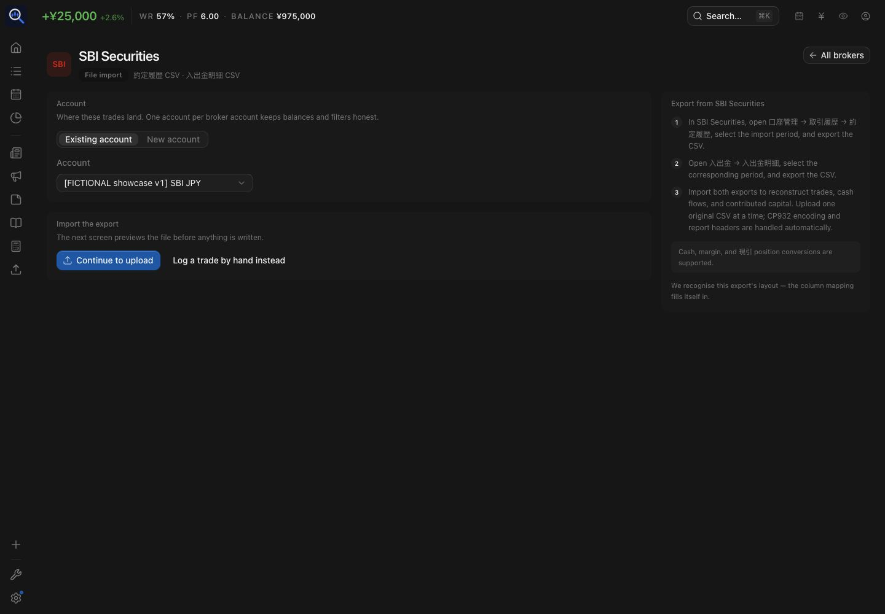
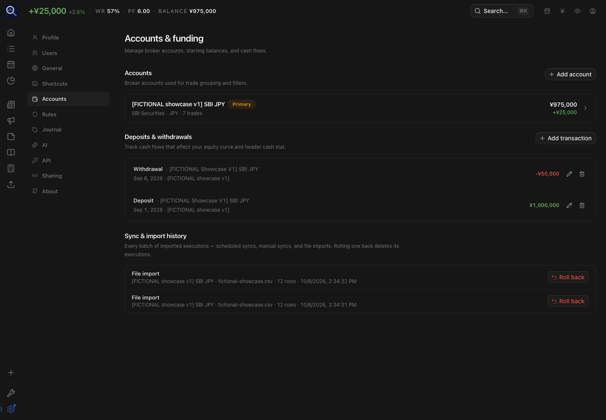

# SBI Securities Import

## Status

Implemented for SBI Securities `約定履歴照会` and `円貨入出金明細` CSV exports.

## Web walkthrough

Create or select a JPY account, then open **Import → Find my broker → SBI Securities**.
The current Web guide preserves these Japanese menu labels in every UI language:

1. `口座管理 → 取引履歴 → 約定履歴`: export the execution-history CSV for the required period.
2. `入出金 → 入出金明細`: export the corresponding cash statement (`円貨入出金明細`).
3. Choose the account and **Continue to upload**. Upload each original file separately;
   the parser handles CP932 and report headers. Use **Preview import**, inspect the detected
   format, row counts and errors, then confirm only after checking the destination account.

These labels match `web/src/lib/brokers.ts`; this capture verifies the TradeLens guide,
not a live SBI website session. A cash statement cannot substitute for execution history:
you need both to reconstruct trades and contributed capital. Incomplete opening history
cannot establish missing cost basis or opening holdings.




The deterministic [showcase](../showcase-demo.md) imports 12 synthetic execution-history
rows through the public preview/commit APIs, expanding 現引/現渡 to 14 executions and
seven closed groups. Cash, margin long/short and the two settlement cases reconcile to
JPY 25,000 net P&L. The list does not expose every position/settlement attribute; use
execution details and the seed audit table to distinguish those cases.



The showcase cash flows use the public ledger API, **not a cash-statement upload**.
They show +1,000,000 deposit and -50,000 withdrawal; contributed capital is 950,000,
and balance/account value is 975,000 after P&L. These are invented numbers.

**Capture limitation:** browser file selection failed (built-in chooser timeouts, then
external native capture-service failure). SBI preview/confirmation/result screens were
not captured or exercised end to end in this run. API import and duplicate checks passed;
those do not replace browser upload acceptance. This documentation refresh remains
unfinished until that required Web case is run. Mobile was not validated.

## Goal

Import Japanese equity trades exported by SBI Securities into TraderMemos.

## Non-goals for v1

- Trade-linked dividend attribution (cash-statement dividends import as ledger entries)
- Investment trusts
- NISA-specific tax handling
- Automated SBI login
- SBI website scraping
- Automatic account synchronization

## Architecture Principle

Reuse the current importer pipeline:

```text
SBI CSV
  → SBI-specific detection and normalization
  → importer.ParsedExecution
  → existing validation and deduplication
  → importer.Commit
  → existing persistence and trade grouping
```

Broker-specific code should live under `api/internal/importer/`, with real fixtures in
that package's `testdata/`. Prefer an isolated SBI parser when normalization cannot be
expressed safely as a `BrokerPreset`; keep any preset/dispatch registration to one small
integration point.

Do not write SBI rows directly to database tables unless a later design review proves
that the canonical importer cannot represent required data.

## Candidate v1 Fields

- `symbol`
- `side`
- `quantity`
- `price`
- `executed_at`
- `fees`
- `account`

Japanese security codes are strings, not numbers. Valid examples include `6501`, `285A`,
`200A`, and `584A`; parsing must preserve them verbatim.

## Japanese Margin Trading

The design must be able to represent:

- `現物買`
- `現物売`
- `信用新規買`
- `信用新規売`
- `信用返済買`
- `信用返済売`

The verified export headers are `約定日`, `銘柄コード`, `取引`, `約定数量`,
`約定単価`, and `手数料/諸経費等`. Cash, margin-long, and margin-short fills are
grouped separately. `現引` becomes a margin-long close followed by a cash open at the
same price; its fee is charged once on the margin close.

Each SBI fill carries generic `position_type` (`cash`, `margin_long`, or
`margin_short`) and `position_effect` (`increase` or `reduce`) in
`executions.details`. The parser also sets these on `ParsedExecution`. The
existing `lot` detail remains the grouping key, and deduplication is unchanged.
Other importers leave these optional fields unset; accounting must keep its
current default behavior unless a broker-specific rule explicitly opts in.

## Encoding

The verified export uses CP932. It is decoded before header detection with the project's
existing `golang.org/x/text` dependency; UTF-8 fixtures remain accepted for tests.

## Timezone

Treat offset-less SBI timestamps as `Asia/Tokyo`, then follow the existing importer's
timezone normalization behavior. Timestamps that include an explicit offset remain
authoritative.

## Deduplication

Reuse `importer.DedupHash` and `importer.Commit`. Do not create an SBI-only duplicate
detection or persistence path.

## Cash transactions

`円貨入出金明細` imports directly into the existing cash ledger with currency `JPY`:

- bank funding and withdrawals → `deposit` / `withdrawal`;
- interest and dividends → `dividend`;
- tax withholding, tax refunds, and other broker adjustments → signed `adjustment`.

The Japanese category and description remain in the note. Re-import compares the full
ledger record and skips the matching number of duplicates while preserving legitimate
identical rows in the same export. Import History rollback removes cash rows from that
batch together with its executions.

## Import flow and client behavior

The API detects an SBI cash file during `POST /api/v1/imports` and returns
`format: cash_transactions` with `detected_broker: SBI Securities (Cash Transactions)`.
The preview is parse-only; it does not create a batch or write ledger rows. Commit through
`POST /api/v1/imports/commit` writes the parsed rows to the selected account and reports
the count as `cash_inserted`; duplicate rows are reported in `skipped`.

The Web and mobile import screens recognize this format and skip execution column mapping.
They show the SBI cash-ledger explanation during the confirmation step and show cash rows
inserted in the result instead of an execution `Inserted`/`Fills inserted` count.

## Verification status

Covered by the SBI parser fixture and tests: CP932 decoding, UTF-8 acceptance, header
detection, JPY conversion, deposit/withdrawal/dividend/adjustment classification,
Asia/Tokyo date normalization, malformed-row reporting, duplicate handling, and batch
rollback. The Web preview/result behavior has a focused component test.

The #254 showcase API preview/commit and duplicate-import checks passed on disposable
SQLite. Browser upload acceptance remains blocked as described above. Mobile not validated;
outside current fork scope.

## Testing

The anonymized implementation fixture covers:

- cash buy and cash sell;
- margin long open and margin short open;
- margin repayment in both applicable directions;
- an alphanumeric Japanese ticker;
- duplicate rows;
- a malformed row;
- the verified SBI encoding;
- offset-less timestamps interpreted in `Asia/Tokyo`.

The fixture must be real and anonymized. Tests should prove canonical parsed executions,
duplicate handling, and commit/regroup behavior without weakening upstream tests.
