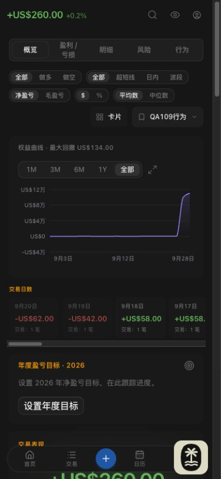
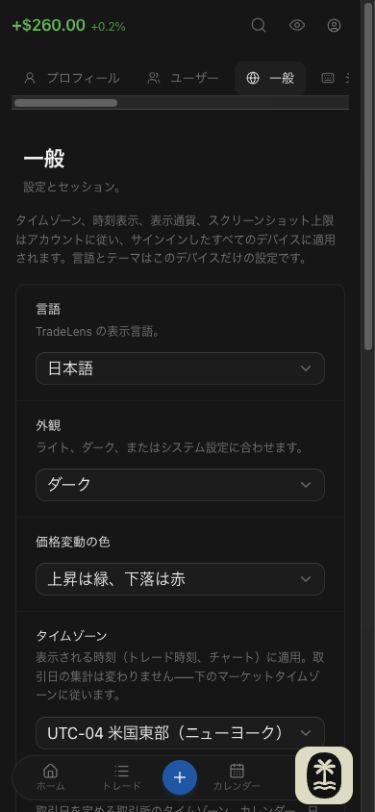
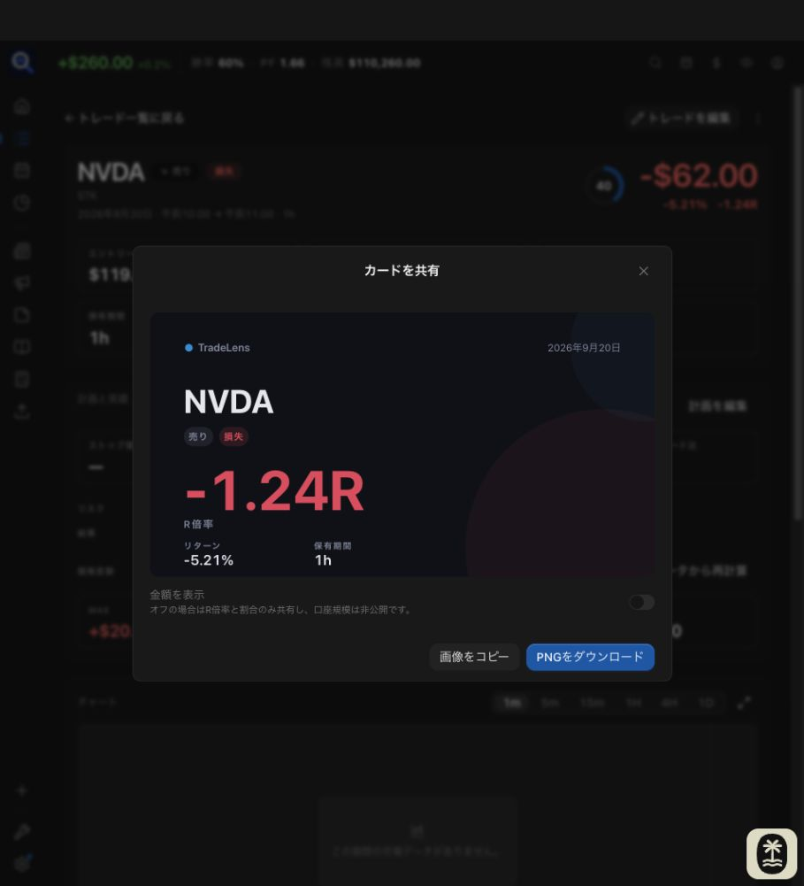
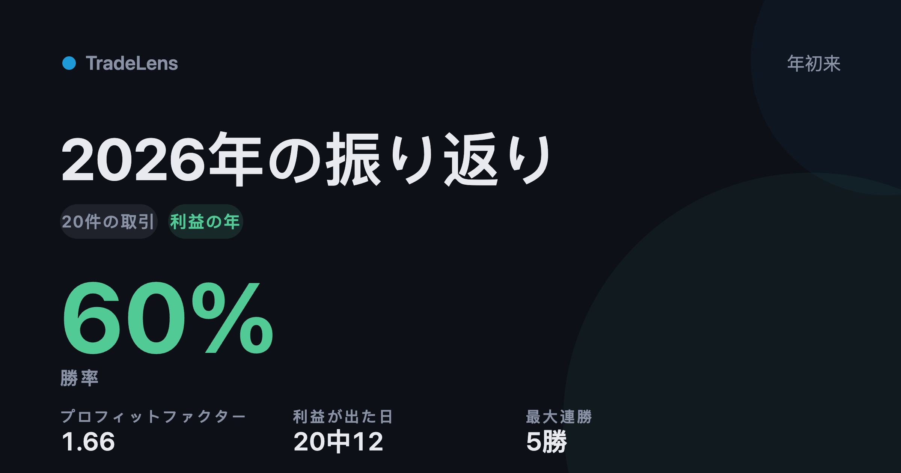

# Issue #109 Web localization acceptance

Date: 2026-09-29. Scope: English, Simplified Chinese and Japanese secondary Web surfaces; existing zh-HK/ko English fallback.

## Environment

Built-in Codex browser against the working-tree Web dev server (`127.0.0.1:5183`) and a separate working-tree API (`127.0.0.1:8093/api/v1`). The API used a throwaway SQLite database under `/private/tmp`, a synthetic owner, two synthetic accounts and 20 closed trades across four symbols, dated September 1–20. No production account or broker credentials were used. Baseline net P&L was USD 260; short-only was five trades / USD -110 and long-only was 15 trades / USD 370. The economics calendar and currency converter returned data through the real API.

## Browser evidence

| Surface | Exercised behavior and observed result |
| --- | --- |
| Reports | All five sections rendered in Chinese. All/long/short, net/gross, amount/percent, mean/median and holding-duration controls were driven in both directions; swing-only produced zero trades and All restored 20. Card visibility changed the actual card list. Up/down ordering, close/reopen read-back and Restore defaults were exercised. Save-view cancel/re-entry started with an empty draft; a named synthetic view was saved and appeared in the menu. |
| Year Wrapped | Japanese 2026 results, previous-year empty state and return to 2026. Native localized month labels. Sharing amounts on/off changed the card from a win-rate/ratio presentation to money and back; reopen reflected the off state. |
| Share/export | Wrapped and single-trade Japanese SVG cards rendered. Copy image produced actual `image/png` clipboard payloads; the Wrapped PNG was saved and visually inspected. Download PNG was invoked, but the built-in browser's download observer returned no local path. Chrome fallback was attempted and unavailable. File landing is therefore unverified, not reported as passing. The existing download implementation was retained. |
| Settings/auth | Japanese settings sections rendered, including timezone/hour-format labels. Risk-rule cancel discarded the draft; saving USD 100 updated the summary and reopened with 100. Checklist save/read-back, cancel of a changed draft and restoring an empty checklist were exercised. Formatting/link toolbar labels were inspected and link cancel returned to the editor. Password-change and add-user dialogs were opened and cancelled without submitting credentials or access changes. Japanese login successfully authenticated the synthetic user; password show/hide worked both ways. AI enabled/disabled controls and API-key show/hide were driven without supplying a provider key. |
| Command palette | Japanese navigation/action/tool groups, search with no result, matched navigation/tool execution and fresh query on re-entry. |
| Calculator/tools | Stock/options, buy/sell, exit presets, R/FVG, FVG entry modes and return to R were exercised. A short-side invalid-stop case displayed the localized warning. Position sizing returned 1,000 shares at entry 100 / stop 99 and returned to the empty guidance for equal entry/stop. Kelly positive/negative edge and restoration were exercised. FX actual conversion, equal-currency result, empty amount, USD/EUR swap and reverse swap were exercised. |
| Broker connection | IBKR connection instructions and every non-SBI tutorial were opened and returned from. Provider navigation labels and imported column names stayed intact. Empty Query ID and empty token produced Japanese validation; scheduled-sync on/off and manual/background explanations were inspected. |
| Calendar | High impact plus JPY produced the explicit empty-filter result; clearing both filters restored events. Next/previous week were exercised. Date-range selection/reopening exposed localized full dates, Today and selected suffixes; All time restored the baseline. |
| Generated text | Risk-rule labels and generated trade-coach notes were inspected in Japanese; broker keys, rule keys, currency codes, user content and provider diagnostics retain their original values. API-generated grouping keys such as `(none)` are retained where the response cannot distinguish a sentinel from a user-named group. |
| Locale/layout | Live ja → en → zh-CN → ja changes were exercised. Reload retained Chinese selection. Chinese Reports/Settings and Japanese Settings/Wrapped/calculator were visually inspected at 390px; the viewport was restored afterwards. |

## Checks and boundaries

- Lingui extraction and compilation completed; en/zh-CN/ja entries are provided and existing zh-HK/ko fallback is preserved.
- `pnpm check --fix`: zero errors; lint warnings remain and are not represented as a clean warning-free run.
- Full suite: 180 files / 1,040 tests passed. Final related regression run: six files / 32 tests passed. Production build and `git diff --check` passed.
- Regression coverage includes live locale refresh of static descriptors, fallback locales, stable broker/rule identifiers, localized share-card tones and avoiding duplicated return metrics.
- A full-suite rerun hit an unrelated NewsView 5-second timeout; the next complete run and the final targeted NewsView run passed. No test timeout was widened.
- Real IBKR credential save/sync, provider-backed AI success and authentication/security mutations were not performed. Their existing API contracts remain unchanged; connection success/counts are covered by the existing mocked regression test.
- Mobile not validated; outside the current private-fork scope. No accounting, importer or persisted-user-content semantics were changed.

## Screenshots

