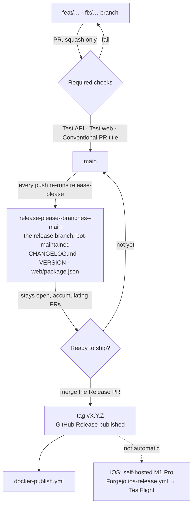
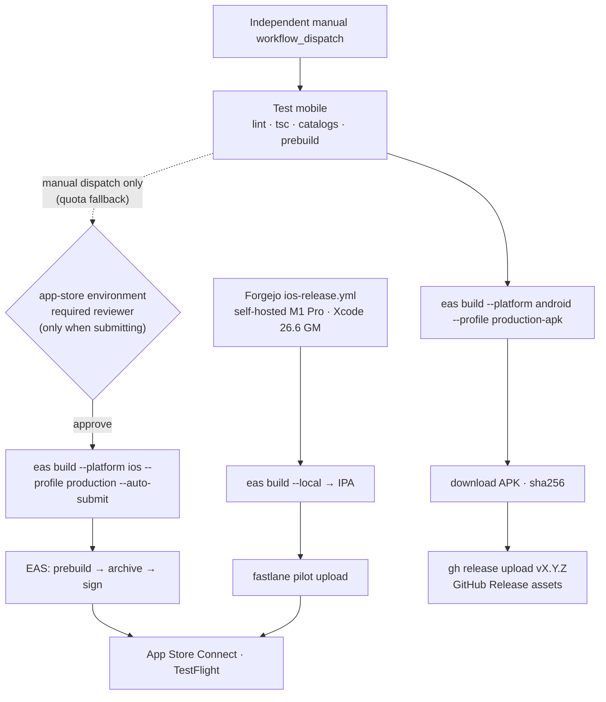

# Release workflow

## Current publication state

Official TradeLens GHCR images are published: **v0.2.1**, source
`b78c5925778831e7d2d039a4d0139ff1ddfc6e31`. Registry/runtime evidence is in
[the validation record](validation/issue234/v0.2.1/README.md).
Docker publisher (`docker-publish.yml`) and Release Please (`release-please.yml`)
remain `disabled_manually`. Image distribution exists; automated continuous
publishing is not enabled. This change does not authorize workflow enablement.

`make up` / `make up-postgres` use official GHCR images; source fallback remains
`make up-build` / `make up-postgres-build`. Pin stable `TM_IMAGE_TAG=0.2.1` in
production. Never alternate upstream and TradeLens on the same database:
the migration histories have diverged. See [deployment](deploy.md).

## Configured release design (inactive)

The remaining sections describe the configured workflow **if deliberately enabled
and configured later**, not current release availability. Credentials and required
reviewers must be verified before enabling; this document does not establish that
the live invocation has passed its approval gate.

The retained [release-please](https://github.com/googleapis/release-please) configuration
handles semver, changelogs, and GitHub Releases when enabled.



There is no hand-cut release branch: `release-please--branches--main` **is** the
release branch, maintained by Release Please. An unchanged generated PR body
can leave it behind `main`; use the recovery procedure below before release.
Merging the Release PR triggers release creation; updating its branch does not.

The intended workflow uses linear history and squash-only merges instead of
GitFlow-style release branches. Owner must enforce that policy before activation. Squashing a release branch would also
collapse its commits into one subject, destroying the individual `feat:` / `fix:`
lines release-please reads to build the changelog.

## Intended day to day (after enablement)

1. Merge PRs to `main` with **Conventional Commit** titles. Merges are
   squash-only and the PR title becomes the commit subject; the
   "Conventional PR title" check blocks non-conventional titles.
2. release-please opens or updates a **Release PR** (`chore: release X.Y.Z`),
   and keeps it current as further PRs land. Leave it open until a release is
   actually wanted — it is a standing draft, not a queue to drain.
3. Review the changelog and version bumps (`VERSION`, `web/package.json`, `CHANGELOG.md`).
4. Merge the Release PR → GitHub Release `vX.Y.Z` is created.
5. Approve the `ghcr` deployment → Docker images are published.
6. Build iOS separately: dispatch `ios-release` on the private Forgejo remote
   (see [Mobile releases](#mobile-releases)). It is **not** part of this chain.

## Recover a Release PR that is behind main

Release Please 17.6.0 skips updating an existing PR when its generated body is
unchanged. Documentation or maintenance commits omitted from release notes can
therefore leave the release branch behind even after a successful main run.
This can recur; rerunning the same action does not guarantee a branch refresh.
See the [Release Please implementation](https://github.com/googleapis/release-please/blob/v17.6.0/src/manifest.ts#L1089-L1102).

Use GitHub's supported [Update branch merge](https://docs.github.com/en/pull-requests/how-tos/create-pull-requests/keeping-your-pull-request-in-sync-with-the-base-branch)
or `gh pr update-branch <number> --repo HoesenBruce/TradeLens` (without
`--rebase`). This merges latest main into the release branch without rewriting
history. It does not merge the PR into main. The repository currently has
`allow_update_branch=false`; the head-guarded REST update endpoint was verified
for #258 without changing that setting:

```sh
gh api --method PUT repos/HoesenBruce/TradeLens/pulls/<number>/update-branch \
  -f expected_head_sha=<verified-release-pr-head-sha>
```

Before updating, confirm the PR is open, targets main, has no conflicts, and its
only diff is the expected generated release files. Record main/head SHAs and
the exact diff. Stop on conflicts or version discrepancies; do not hand-edit
VERSION, manifest, CHANGELOG or package versions, force-push, or bypass rules.
After updating, verify main is an ancestor of the new head, the generated diff
is unchanged, all version files agree, and fresh required API/Web/title checks
pass on that head. Recheck main immediately before a separately authorized
squash merge. A merge commit on the release branch is compatible with main's
linear-history rule because the final PR merge is squash; do not merge that
merge commit directly into main.

Release Please still owns version calculation and generated files. Future
release-note changes may regenerate its branch, so always repeat these checks.
No new token, automatic updater workflow, weakened branch protection or forced
version is needed. Keep recovery manual before release; this also avoids granting
an unattended updater permission to modify arbitrary PR branches. Any later docs
PR merged into main can require another refresh of the open Release PR.

Branch refresh is not release acceptance: verify tag/Release absence, publication
workflow safety and GHCR approval separately. Never approve deployments or create
release artifacts as part of this recovery.

## Commit messages

| Prefix | Semver bump (pre-1.0) | Example |
|--------|----------------------|---------|
| `fix:` | patch | `fix: healthz version lookup` |
| `feat:` | minor | `feat: about tab updates section` |
| `feat!:` / `fix!:` + `BREAKING CHANGE:` | major | `feat!: remove legacy import API` |
| `chore:`, `docs:`, `refactor:` | none | `chore: bump vite` |

`feat:` bumps **minor** (`0.1.13` → `0.2.0`) and `fix:` bumps **patch**, so the
version says which kind of change shipped. Set
`bump-patch-for-minor-pre-major: true` in `release-please-config.json` to send
pre-1.0 `feat:` back to patch.

### Force a version

Add to the PR description (it becomes the squash-merge commit body):

```text
Release-As: 0.2.0
```

### Release notes granularity

Each release lists the conventional commits merged since the previous tag.
Merging the Release PR after every feature PR yields one-line releases and a
`chore: release` commit between every pair of real ones; letting 5–10 PRs
accumulate yields fuller notes and a readable `main` history. Prefer the latter.

## Version files

| File | Purpose |
|------|---------|
| `VERSION` | Source of truth for API + web builds |
| `web/package.json` | Kept in sync by release-please |
| `mobile/package.json` | Kept in sync by release-please |
| `mobile/app.json` (`expo.version`) | Marketing version of the mobile builds (both platforms) — kept in sync by release-please |
| `CHANGELOG.md` | Human-readable release notes |
| `.release-please-manifest.json` | Last released version (managed by release-please) |

The **build number** (iOS `CFBundleVersion`, Android `versionCode`) is not in
this table: `eas.json` sets `appVersionSource: "remote"`, so EAS owns both and
auto-increments them per production build. Only the marketing version comes
from the repo.

## Docker images

The disabled workflow targets only `ghcr.io/hoesenbruce/tradelens-api` and
`ghcr.io/hoesenbruce/tradelens-web`. No legacy container aliases are published.
Compose defaults use these official images.

| Build | Tags |
|---|---|
| Latest stable published release | `x.y.z`, `x.y`, `x`, `latest`, `sha-<full SHA>` |
| Published prerelease | exact version, `sha-<full SHA>` |
| Manual build without version | `sha-<full SHA>` only |

Versioned dispatch/backfill must use the exact `refs/tags/v<version>` ref. The resolver
requires a matching non-draft GitHub Release, matching prerelease flag and tag SHA.
Older stable backfills fail closed rather than roll moving tags backwards. Stable
moving tags require the version to match GitHub's latest stable Release. Metadata
Action's automatic `latest` tag is disabled. Builds share one resolved full SHA,
version and build timestamp; API/Web CI explicitly check out that resolved release commit.
Publication is serialized. Each image digest is saved in the run summary and a
90-day artifact; copy both to the durable first-release validation record.

### Approval, visibility and first publication

Keep Docker publishing and Release Please **disabled** until the first-release
validation issue is ready and publication gates are cleared. Configure the `ghcr`
environment with a required reviewer before enablement. `GITHUB_TOKEN` uses
`contents: read` plus `packages: write` only in the publishing job; Docker Hub
credentials are no longer used. Reusable-workflow callers must grant these permissions.

The intended visibility of **both** packages is **public**, including when the
source repository is private. First-created packages can be private: after the
controlled first publication, the owner must explicitly set each package's
Settings → Change visibility → Public and verify its repository link and Actions
write access. This workflow does not claim to configure visibility automatically.
See [GitHub's registry documentation](https://docs.github.com/en/packages/working-with-a-github-packages-registry/working-with-the-container-registry).

Use an empty Docker config (no login) to pull both recorded digests:

```sh
qa_config=$(mktemp -d)
DOCKER_CONFIG="$qa_config" docker pull ghcr.io/hoesenbruce/tradelens-api@sha256:<recorded-api-digest>
DOCKER_CONFIG="$qa_config" docker pull ghcr.io/hoesenbruce/tradelens-web@sha256:<recorded-web-digest>
```

Record run URL, version, full source SHA, tags, both digests, package visibility
read-back, anonymous pull output and amd64/arm64 manifest inspection in the
first-release validation issue. Public visibility and anonymous pulls for v0.2.1 are verified in the linked
validation record; implementation alone is not publication evidence.

## Mobile releases

The disabled Android workflow is configured to build on [EAS Build](https://docs.expo.dev/build/introduction/) and has
no store presence: the release-signed APK is attached to the GitHub Release page,
which is the Android distribution channel (same shape as the tm-sync binaries).

**iOS does not build here.** EAS cloud builds are metered, and a release spent
two of them — one per platform — so the month's quota ran out and the iOS build
of v0.12.0 failed while Android squeaked through. iOS now builds on the
self-hosted M1 Pro via `ios-release.yml` on the private Forgejo remote: same
Xcode EAS uses (26.6 GM), unmetered, with the App Store Connect key in that
repo's secrets and the upload done by `fastlane pilot`.

`mobile-eas.yml` still accepts `platform: ios` by manual dispatch, and is worth
keeping for it: the quota resets monthly, and one self-hosted Mac is a single
point of failure.



Android is excluded from the Release Please chain. Independent manual builds
remain available via `workflow_dispatch`: platform `android`, profile
`production-apk`, *attach-to-release* set to the bare version (`0.8.4`).

### Build profiles (`mobile/eas.json`)

| Profile | Distribution | Used for |
|---------|--------------|----------|
| `development` | internal, simulator | dev-client build without a local Xcode toolchain (Android: APK) |
| `preview` | internal | ad-hoc install on registered devices (Android: APK) |
| `production` | store | release builds; `autoIncrement` bumps the EAS-side build number |
| `production-apk` | internal | release-signed APK for the GitHub Release page (extends `production`) |

The three base profiles repeat their `node`/`corepack`/`env` lines rather than sharing
an `extends: base` parent. An abstract parent is still a selectable profile in every
`eas` prompt, and picking it in `eas credentials` configures credentials against a
profile nothing ever builds — the duplication is cheaper than that footgun.
(`production-apk` extends `production`, which is fine: `production` is a real,
buildable profile, not an abstract parent.) `production` keeps
`buildType: "app-bundle"` so a Play Store submission stays one profile away if a
store presence ever happens; `production-apk` overrides it to a directly
installable APK.

`groups: ["Internal Testers"]` makes EAS Submit attach every submitted build to
that TestFlight group, so a release reaches testers without anyone opening App
Store Connect. The workflow also passes `--what-to-test`: a release build gets
that version's `CHANGELOG.md` section (markdown stripped, since TestFlight
renders plain text), any other build gets the commit subject.

`submit.production.ios` carries `ascAppId` (the App Store Connect app record for
`com.tradermemos.app`) and `appleTeamId` as literal values. They have to be
literal — EAS expands `$VAR` references only in the `ascApiKey*` fields, so an
env var would be submitted verbatim and rejected. Neither is a secret: the ASC
app ID is the number in an App Store URL and the team ID ships inside every
signed binary. Change them only if the app moves to a different Apple account;
the workflow's preflight step refuses to start a submitting build if either is
missing or malformed.

`submit.production.android` (Play internal track via a service-account key) is
aspirational: the key path it references does not exist in the repo, nothing
invokes it, and the workflow refuses `submit` on Android. Until a Play Store
presence exists, the APK on the GitHub Release page is the Android channel.

### Export compliance

`app.json` declares `ios.infoPlist.ITSAppUsesNonExemptEncryption: false`. Without
it, every uploaded build parks in App Store Connect waiting for the encryption
question to be answered by hand, which would stall the automated TestFlight
hand-off on each release. The declaration is the standard exemption for an app
whose only cryptography is HTTPS/TLS and the system Keychain (via
expo-secure-store) — revisit it if the app ever ships its own crypto.

### One-time setup

Nothing below is in the repo — it lives in the Expo and GitHub accounts.

1. `cd mobile && npx eas-cli login && npx eas-cli init` — links the app to an EAS
   project and writes `extra.eas.projectId` into `app.json`. **Commit that.**
   Until it exists, every EAS command fails with "project not configured".
2. `npx eas-cli credentials` — upload (or let EAS generate) the iOS distribution
   certificate and provisioning profile, plus the App Store Connect API key that
   EAS Submit uses. Nothing Apple-related is stored in this repo.
3. `npx eas-cli credentials -p android` — let EAS generate the Android release
   keystore once. A `--non-interactive` CI build cannot create one and fails
   with a credentials error until it exists. The keystore lives on EAS; losing
   it means future APKs no longer upgrade-install over old ones, so leave it
   managed there.
4. GitHub repo secret `EXPO_TOKEN` (expo.dev → Account → Access tokens).
5. Settings → Environments → **`app-store`**: add yourself as a required
   reviewer. Same shape as the `ghcr` gate — nothing reaches TestFlight
   without an explicit approval.

### Manual builds

**EAS Build** via `workflow_dispatch` — pick a platform and profile, tick
*submit* only when an iOS build should also go to TestFlight, set
*attach-to-release* to a bare version to put an Android APK on that release.
Locally: `make eas-build-preview`, `make eas-build-ios`, `make eas-submit-ios`,
`make eas-build-android` (release APK via `production-apk`).

`cli.requireCommit` is on, so EAS builds from committed state only; a dirty tree
is rejected rather than silently building something that is not in git.

### Why prebuild is a CI step

EAS runs its own `expo prebuild` on the build worker, so `ios/` as generated
locally never reaches it. The UIScene lifecycle adoption iOS 27 requires
(expo/expo#46663) therefore lives in the `with-ios-scene-lifecycle` config
plugin rather than in `scripts/apply-ios-scene-patch.sh` alone. Mobile CI runs
the same prebuild and asserts the `SceneDelegate` landed — without it the app
builds fine and traps on launch.

## CI gates

`Test API`, `Test web`, and `Conventional PR title` must be configured as required
status checks on `main` before activation. On 2026-10-08, the repository rulesets
API returned an empty list and branch protection returned "Branch not protected";
these gates are desired policy, not verified active settings. The same test jobs are reused by `docker-publish.yml`, so a release
can never publish images that skipped tests.

`Test mobile` runs only on PRs touching `mobile/**`, so it is not a required
check (a required check that never runs blocks every other PR). `mobile-eas.yml`
reuses it, so a release build still cannot skip it.

Owner must configure main protection: PRs required, the three checks above,
linear history, no force-push/deletion and no bypass actors. Use squash merging
so Conventional Commit PR titles become commit subjects. A single-maintainer
repository may use zero required approving reviews while still requiring PRs
and successful checks. Verify the settings are enforced for this repository
and account plan before activating releases.


## #235 automation repair and owner activation checklist

This design is inactive: both Release Please and Docker publisher remain
`disabled_manually`. No production release is authorized by this change.

### Baseline and version calculation

The manifest and `VERSION` remain `0.2.1`. Release Please discovers its release
boundary from the matching GitHub Release/tag, not the first heading in the
changelog. Removed `bootstrap-sha` referred to an existing commit outside current
main ancestry; bootstrap is only a fallback before a release boundary exists.
Do not replace it with a permanently pinned `last-release-sha`.
The preserved upstream changelog is historical text, not a version baseline.
From `0.2.1`, an isolated `fix:` yields `0.2.2`; an isolated `feat:` yields
`0.3.0`. Current post-release main contains only docs/chore changes; this repair's
`fix:` squash commit is the next release-bearing change. Review actual accumulated
commits before merging the generated Release PR. Mobile marketing extra-files
remain synchronized; runtime/build settings are unchanged.

### One Docker publication path

Only Release Please's successful `releases_created` output calls `publish-docker`.
Docker has no release-event, push or tag trigger. This avoids double publication
when Release Please uses a PAT. GitHub's default token generally suppresses
workflow events it creates; the explicit reusable call does not depend on those
events. PR events created with GITHUB_TOKEN may require approval under current
GitHub behavior; verify on this repository before relying on automatic PR CI.

The reusable call inherits the caller's `github.ref` (`refs/heads/main`), even
when checkout selects a tag commit. Environment policy matches the run ref, not
checkout HEAD. **Owner must add a branch policy for exactly `main` alongside the
existing tag policy `v*` in `ghcr`.** Keep required reviewer, administrator bypass
disabled, and the existing single-owner self-review setting. No environment
setting is changed by this PR. A tag-only environment blocks the automatic call.
Release Please passes its returned release `sha` to the reusable workflow.
Initial metadata resolution requires the published tag commit to equal that SHA;
manual dispatch requires it to equal `github.sha` on the exact tag ref.
API/Web tests and image builds use the resolved published tag SHA. Validation
runs from the workflow revision, before checking out the release source.

After approval, metadata is revalidated against the current published Release and
latest stable release. Exact version and full-SHA image tags must be absent;
registry errors other than 404 fail closed. Existing immutable tags abort rather
than silently overwrite. Moving tags are only emitted for latest stable;
prereleases emit no major/minor/latest tags. Ordinary PR/main pushes cannot
publish without a newly created Release Please release.

### Environment options and owner UI steps

| Option | Assessment |
|---|---|
| A: allow exact main branch plus v* tags | Selected. Direct reusable call works with either token type, has one automatic trigger and preserves tag-ref manual recovery and required reviewer. Main code needs enforced PR/check protection. Live invocation remains to be verified. |
| B: publish in tag context | Release-event trigger requires PAT/App events; GITHUB_TOKEN release events generally do not trigger it. Explicit dispatch would need a dispatch credential and reliable delivery/recovery. Either replaces the reusable chain or risks duplicates if both remain. More moving parts for this repository. |

Owner: Settings → Environments → ghcr → Deployment branches and tags → Selected
branches and tags → Add deployment branch or tag rule → Branch → `main`.
Retain the Tag → `v*` rule, Required reviewers → HoesenBruce, and disable
administrator bypass. Keep self-review allowed for the current single owner.
Settings → Rules → Rulesets (or Branches → branch protection): target `main`,
require PRs and the three CI checks, enforce linear history and prevent
force-push/deletion; verify enforcement and bypass settings. No settings are
changed by this PR.

### Authentication and permissions

For this single-maintainer repository, the simplest automatic PR-CI option is a
fine-grained PAT in `RELEASE_PLEASE_TOKEN`, scoped only to this repository with
Contents, Pull requests and Issues read/write (metadata read is implicit).
Set an expiry and rotation reminder outside this workflow. Never paste tokens
into files or logs. The action falls back to GITHUB_TOKEN; explicitly approve
its PR checks when GitHub requires it. Current GitHub documentation says token-created
opened/synchronize/reopened PR events create approval-required runs; push/release
events from that token remain generally suppressed. No token-generated Release
PR has been exercised in this repository, so that repository-specific behavior
is NOT VERIFIED. The human-created PR #252 passing CI does not prove bot PR CI. Repository Actions settings must allow PR
creation. Existing workflow permissions are narrowed per job; only publishing
receives Packages write, using GITHUB_TOKEN, never the release PAT.

A GitHub App is an alternative for centralized credential lifecycle: install it
only on this repository with the same permissions, generate an installation token
using `actions/create-github-app-token`, and pass that token to Release Please.
That requires a separately reviewed workflow change and App ID/private-key secrets;
it is not configured here. A PAT already fits the existing token input.

### Recovery and digest records

Manual backfill uses Docker workflow dispatch on the exact release tag, with its
bare version input. It still requires a published Release, latest-stable checks,
API/Web CI and GHCR approval. An arbitrary branch dispatch is skipped.
Empty version permits only a SHA build on a `v*` tag ref.
These protections apply to tags containing this repair. Older tags execute their
historical workflow definition; do not dispatch them as a recovery shortcut.
Backfilling a pre-repair tag requires a separately reviewed recovery workflow.
Copy both image digests, version, full source SHA and run URL from the run summary
and 90-day artifacts into the durable release validation record.

If either image/version/SHA tag already exists, stop and inspect both registries
and recorded digests. A partial failure can leave one image published; do not
rerun blindly or delete tags to bypass validation. Owner recovery requires a
separately reviewed repair that verifies existing digests and publishes only the
missing image, or a new patch release. This workflow deliberately fails closed.
Neither tm-sync nor Android is called by Release Please. Their independent
workflows, sources, credentials and historical assets remain intact; keep the
independent tm-sync workflow disabled unless its release-event behavior is wanted.
iOS retains its independent workflow.

### Immutable-tag and timing limits

Registry inspection is a preflight check, **not atomic registry immutability**.
The publication concurrency group serializes this repository's publisher runs;
it does not lock external publishers, package administrators or other workflows.
An external writer can create/change a tag between inspection, a long build and
push. A new stable Release can also appear after revalidation and before push.
Before activation, owner must limit package write access to this controlled path
and avoid out-of-band publication/release creation while a run is in progress.
Recheck latest stable and tags when reviewing a delayed run. If concurrent
external writers are required, this design needs registry enforcement or a
separate publish promotion design before activation.

The guard is for the two known public TradeLens packages. Token endpoint failures,
401/403 authorization failures, rate limits and server errors abort; only manifest
404 permits proceeding. Private-package live responses have not been tested;
changing visibility requires a separate access/absence validation before use.
Namespace is fixed to `ghcr.io/hoesenbruce/tradelens-{api,web}` by the matrix.

### Failure recovery decision table

| Failure | Safe response |
|---|---|
| API succeeds, Web fails (or inverse) | Record successful digest and inspect both tags. No blind rerun; reviewed missing-image repair or a new patch release. |
| Both builds finish, push fails | Inspect both registries; a failed push may already have uploaded manifests/tags. Retry only after establishing that all immutable tags remain absent. |
| Approval rejected/expires, no writes | Inspect run/registry; if still absent, retry failed jobs or exact-tag dispatch and reapprove. |
| New stable appears during approval | Stable revalidation fails; do not move latest backward. Review newer release and abandon obsolete stable publication. |
| Canceled after one publication | Treat as partial publication; do not infer absence from run status. |
| Same release rerun / SHA tag exists | Existing version or SHA tag aborts that image job. Release Please usually emits no new release on a fresh run; failed-job reruns retain prior outputs. |
| GitHub Release exists, Docker incomplete | Keep the Release and inspect digests. Use the same decision rules; never delete tags/releases to reset state. |

There is no generic partial-repair command in this PR. This is a documented
operational limitation, not a code-merge blocker: owner must accept the new-patch
fallback before activation, or commission the reviewed digest-aware repair path.
API/Web moving tags are not updated atomically across images; partial publication
can temporarily split them. Production deployments should pin verified versions
or digests and wait for both image records.

### Safe activation order (owner only)

1. Review this Draft PR and its local/simulated evidence. Verify PAT permissions,
   repository PR creation permission, required checks and ghcr reviewer settings.
2. Merge the repair after review. Enable Release Please alone; verify its generated
   PR diff, boundary, version files and CI without merging that Release PR.
   This is the first real generation acceptance; local simulation is insufficient.
3. Add exact `main` branch environment policy while retaining `v*`, required
   reviewer and no administrator bypass. Enable Docker publisher only after this
   configuration and workflow permissions have been read back.
4. Owner reviews/merges the first Release PR. Verify tag/Release SHA, API/Web CI
   source SHA and waiting GHCR deployment before approving either image job.
5. Approve publication, record both digests, inspect both architectures and perform
   runtime acceptance. Close #235 only after successful controlled activation.

References: [Release Please manifest semantics](https://github.com/googleapis/release-please/blob/main/docs/manifest-releaser.md),
[reusable workflow context](https://docs.github.com/en/actions/reference/workflows-and-actions/reusing-workflow-configurations),
[deployment ref policy](https://docs.github.com/en/actions/reference/workflows-and-actions/deployments-and-environments),
[token event behavior](https://docs.github.com/en/actions/how-tos/write-workflows/choose-when-workflows-run/trigger-a-workflow).
