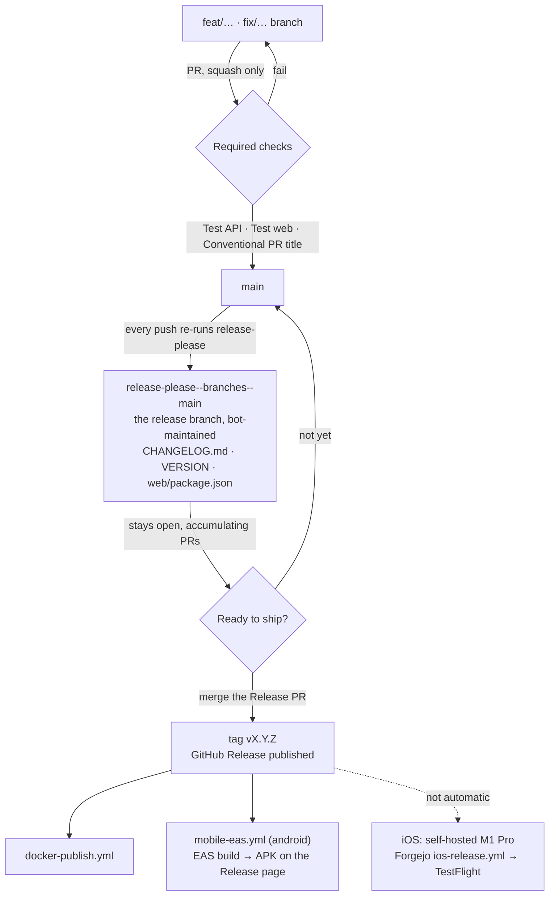
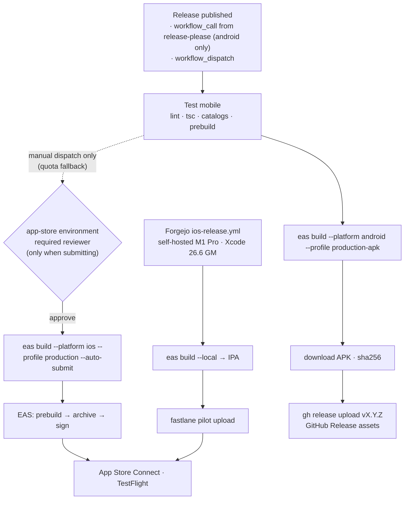

# Release workflow

## Current publication state

Official TradeLens GHCR images are published: **v0.2.1**, source
`b78c5925778831e7d2d039a4d0139ff1ddfc6e31`. Registry/runtime evidence is in
[the validation record](validation/issue234/v0.2.1/README.md).
Docker publisher (`docker-publish.yml`) and Release Please (`release-please.yml`)
remain `disabled_manually`. Image distribution exists; automated continuous
publishing is not enabled. This change does not authorize workflow enablement.

`make up` / `make up-postgres` use official GHCR images; source fallback remains
`make up-build` / `make up-postgres-build`. Pin stable `TM_IMAGE_TAG=0.2.1` in
production. Never alternate upstream and TradeLens on the same database:
the migration histories have diverged. See [deployment](deploy.md).

## Configured release design (inactive)

The remaining sections describe the configured workflow **if deliberately enabled
and configured later**, not current release availability. Credentials and required
reviewers must be verified before enabling; this document does not establish that
the `ghcr` environment currently has an approval gate.

The retained [release-please](https://github.com/googleapis/release-please) configuration
handles semver, changelogs, and GitHub Releases when enabled.



There is no hand-cut release branch: `release-please--branches--main` **is** the
release branch, rebuilt from scratch on every push to `main`. Merging it is the
release. Nothing else tags or publishes.

A GitFlow-style `release/x.y.z` merged into `main` is not possible here and is
not wanted — the ruleset requires linear history and squash-only merges, so the
merge commit it depends on is blocked. Squashing a release branch would also
collapse its commits into one subject, destroying the individual `feat:` / `fix:`
lines release-please reads to build the changelog.

## Intended day to day (after enablement)

1. Merge PRs to `main` with **Conventional Commit** titles. Merges are
   squash-only and the PR title becomes the commit subject; the
   "Conventional PR title" check blocks non-conventional titles.
2. release-please opens or updates a **Release PR** (`chore: release X.Y.Z`),
   and keeps it current as further PRs land. Leave it open until a release is
   actually wanted — it is a standing draft, not a queue to drain.
3. Review the changelog and version bumps (`VERSION`, `web/package.json`, `CHANGELOG.md`).
4. Merge the Release PR → GitHub Release `vX.Y.Z` is created.
5. Approve the `ghcr` deployment → Docker images are published.
6. The Android APK builds on EAS — no approval needed — and lands on the GitHub
   Release page as `TradeLens-<version>.apk` (+ `.sha256`).
7. Build iOS separately: dispatch `ios-release` on the private Forgejo remote
   (see [Mobile releases](#mobile-releases)). It is **not** part of this chain.

## Commit messages

| Prefix | Semver bump (pre-1.0) | Example |
|--------|----------------------|---------|
| `fix:` | patch | `fix: healthz version lookup` |
| `feat:` | minor | `feat: about tab updates section` |
| `feat!:` / `fix!:` + `BREAKING CHANGE:` | major | `feat!: remove legacy import API` |
| `chore:`, `docs:`, `refactor:` | none | `chore: bump vite` |

`feat:` bumps **minor** (`0.1.13` → `0.2.0`) and `fix:` bumps **patch**, so the
version says which kind of change shipped. Set
`bump-patch-for-minor-pre-major: true` in `release-please-config.json` to send
pre-1.0 `feat:` back to patch.

### Force a version

Add to the PR description (it becomes the squash-merge commit body):

```text
Release-As: 0.2.0
```

### Release notes granularity

Each release lists the conventional commits merged since the previous tag.
Merging the Release PR after every feature PR yields one-line releases and a
`chore: release` commit between every pair of real ones; letting 5–10 PRs
accumulate yields fuller notes and a readable `main` history. Prefer the latter.

## Version files

| File | Purpose |
|------|---------|
| `VERSION` | Source of truth for API + web builds |
| `web/package.json` | Kept in sync by release-please |
| `mobile/package.json` | Kept in sync by release-please |
| `mobile/app.json` (`expo.version`) | Marketing version of the mobile builds (both platforms) — kept in sync by release-please |
| `CHANGELOG.md` | Human-readable release notes |
| `.release-please-manifest.json` | Last released version (managed by release-please) |

The **build number** (iOS `CFBundleVersion`, Android `versionCode`) is not in
this table: `eas.json` sets `appVersionSource: "remote"`, so EAS owns both and
auto-increments them per production build. Only the marketing version comes
from the repo.

## Docker images

The disabled workflow targets only `ghcr.io/hoesenbruce/tradelens-api` and
`ghcr.io/hoesenbruce/tradelens-web`. No legacy container aliases are published.
Compose defaults use these official images.

| Build | Tags |
|---|---|
| Latest stable published release | `x.y.z`, `x.y`, `x`, `latest`, `sha-<full SHA>` |
| Published prerelease | exact version, `sha-<full SHA>` |
| Manual build without version | `sha-<full SHA>` only |

Versioned dispatch/backfill must run on the release tag's commit. The resolver
requires a matching non-draft GitHub Release, matching prerelease flag and tag SHA.
Older stable backfills fail closed rather than roll moving tags backwards. Stable
moving tags require the version to match GitHub's latest stable Release. Metadata
Action's automatic `latest` tag is disabled. Builds share one resolved full SHA,
version and build timestamp; tests check that same workflow source commit.
Publication is serialized. Each image digest is saved in the run summary and a
90-day artifact; copy both to the durable first-release validation record.

### Approval, visibility and first publication

Keep Docker publishing and Release Please **disabled** until the first-release
validation issue is ready and publication gates are cleared. Configure the `ghcr`
environment with a required reviewer before enablement. `GITHUB_TOKEN` uses
`contents: read` plus `packages: write` only in the publishing job; Docker Hub
credentials are no longer used. Reusable-workflow callers must grant these permissions.

The intended visibility of **both** packages is **public**, including when the
source repository is private. First-created packages can be private: after the
controlled first publication, the owner must explicitly set each package's
Settings → Change visibility → Public and verify its repository link and Actions
write access. This workflow does not claim to configure visibility automatically.
See [GitHub's registry documentation](https://docs.github.com/en/packages/working-with-a-github-packages-registry/working-with-the-container-registry).

Use an empty Docker config (no login) to pull both recorded digests:

```sh
qa_config=$(mktemp -d)
DOCKER_CONFIG="$qa_config" docker pull ghcr.io/hoesenbruce/tradelens-api@sha256:<recorded-api-digest>
DOCKER_CONFIG="$qa_config" docker pull ghcr.io/hoesenbruce/tradelens-web@sha256:<recorded-web-digest>
```

Record run URL, version, full source SHA, tags, both digests, package visibility
read-back, anonymous pull output and amd64/arm64 manifest inspection in the
first-release validation issue. Public visibility and anonymous pulls for v0.2.1 are verified in the linked
validation record; implementation alone is not publication evidence.

## Mobile releases

The disabled Android workflow is configured to build on [EAS Build](https://docs.expo.dev/build/introduction/) and has
no store presence: the release-signed APK is attached to the GitHub Release page,
which is the Android distribution channel (same shape as the tm-sync binaries).

**iOS does not build here.** EAS cloud builds are metered, and a release spent
two of them — one per platform — so the month's quota ran out and the iOS build
of v0.12.0 failed while Android squeaked through. iOS now builds on the
self-hosted M1 Pro via `ios-release.yml` on the private Forgejo remote: same
Xcode EAS uses (26.6 GM), unmetered, with the App Store Connect key in that
repo's secrets and the upload done by `fastlane pilot`.

`mobile-eas.yml` still accepts `platform: ios` by manual dispatch, and is worth
keeping for it: the quota resets monthly, and one self-hosted Mac is a single
point of failure.



The release-please chain calls `mobile-eas.yml` for Android only, ungated (a
release asset is replaceable with `--clobber`). A missed or failed APK is
backfilled via `workflow_dispatch`: platform `android`, profile
`production-apk`, *attach-to-release* set to the bare version (`0.8.4`).

### Build profiles (`mobile/eas.json`)

| Profile | Distribution | Used for |
|---------|--------------|----------|
| `development` | internal, simulator | dev-client build without a local Xcode toolchain (Android: APK) |
| `preview` | internal | ad-hoc install on registered devices (Android: APK) |
| `production` | store | release builds; `autoIncrement` bumps the EAS-side build number |
| `production-apk` | internal | release-signed APK for the GitHub Release page (extends `production`) |

The three base profiles repeat their `node`/`corepack`/`env` lines rather than sharing
an `extends: base` parent. An abstract parent is still a selectable profile in every
`eas` prompt, and picking it in `eas credentials` configures credentials against a
profile nothing ever builds — the duplication is cheaper than that footgun.
(`production-apk` extends `production`, which is fine: `production` is a real,
buildable profile, not an abstract parent.) `production` keeps
`buildType: "app-bundle"` so a Play Store submission stays one profile away if a
store presence ever happens; `production-apk` overrides it to a directly
installable APK.

`groups: ["Internal Testers"]` makes EAS Submit attach every submitted build to
that TestFlight group, so a release reaches testers without anyone opening App
Store Connect. The workflow also passes `--what-to-test`: a release build gets
that version's `CHANGELOG.md` section (markdown stripped, since TestFlight
renders plain text), any other build gets the commit subject.

`submit.production.ios` carries `ascAppId` (the App Store Connect app record for
`com.tradermemos.app`) and `appleTeamId` as literal values. They have to be
literal — EAS expands `$VAR` references only in the `ascApiKey*` fields, so an
env var would be submitted verbatim and rejected. Neither is a secret: the ASC
app ID is the number in an App Store URL and the team ID ships inside every
signed binary. Change them only if the app moves to a different Apple account;
the workflow's preflight step refuses to start a submitting build if either is
missing or malformed.

`submit.production.android` (Play internal track via a service-account key) is
aspirational: the key path it references does not exist in the repo, nothing
invokes it, and the workflow refuses `submit` on Android. Until a Play Store
presence exists, the APK on the GitHub Release page is the Android channel.

### Export compliance

`app.json` declares `ios.infoPlist.ITSAppUsesNonExemptEncryption: false`. Without
it, every uploaded build parks in App Store Connect waiting for the encryption
question to be answered by hand, which would stall the automated TestFlight
hand-off on each release. The declaration is the standard exemption for an app
whose only cryptography is HTTPS/TLS and the system Keychain (via
expo-secure-store) — revisit it if the app ever ships its own crypto.

### One-time setup

Nothing below is in the repo — it lives in the Expo and GitHub accounts.

1. `cd mobile && npx eas-cli login && npx eas-cli init` — links the app to an EAS
   project and writes `extra.eas.projectId` into `app.json`. **Commit that.**
   Until it exists, every EAS command fails with "project not configured".
2. `npx eas-cli credentials` — upload (or let EAS generate) the iOS distribution
   certificate and provisioning profile, plus the App Store Connect API key that
   EAS Submit uses. Nothing Apple-related is stored in this repo.
3. `npx eas-cli credentials -p android` — let EAS generate the Android release
   keystore once. A `--non-interactive` CI build cannot create one and fails
   with a credentials error until it exists. The keystore lives on EAS; losing
   it means future APKs no longer upgrade-install over old ones, so leave it
   managed there.
4. GitHub repo secret `EXPO_TOKEN` (expo.dev → Account → Access tokens).
5. Settings → Environments → **`app-store`**: add yourself as a required
   reviewer. Same shape as the `ghcr` gate — nothing reaches TestFlight
   without an explicit approval.

### Manual builds

**EAS Build** via `workflow_dispatch` — pick a platform and profile, tick
*submit* only when an iOS build should also go to TestFlight, set
*attach-to-release* to a bare version to put an Android APK on that release.
Locally: `make eas-build-preview`, `make eas-build-ios`, `make eas-submit-ios`,
`make eas-build-android` (release APK via `production-apk`).

`cli.requireCommit` is on, so EAS builds from committed state only; a dirty tree
is rejected rather than silently building something that is not in git.

### Why prebuild is a CI step

EAS runs its own `expo prebuild` on the build worker, so `ios/` as generated
locally never reaches it. The UIScene lifecycle adoption iOS 27 requires
(expo/expo#46663) therefore lives in the `with-ios-scene-lifecycle` config
plugin rather than in `scripts/apply-ios-scene-patch.sh` alone. Mobile CI runs
the same prebuild and asserts the `SceneDelegate` landed — without it the app
builds fine and traps on launch.

## CI gates

`Test API`, `Test web`, and `Conventional PR title` are required status checks
on `main`. The same test jobs are reused by `docker-publish.yml`, so a release
can never publish images that skipped tests.

`Test mobile` runs only on PRs touching `mobile/**`, so it is not a required
check (a required check that never runs blocks every other PR). `mobile-eas.yml`
reuses it, so a release build still cannot skip it.

`main` also carries an active ruleset with no bypass actors: PRs required,
squash-only, linear history, no force-push or deletion. Approvals are set to 0
because the repo is single-maintainer — CI is the gate, not review.
