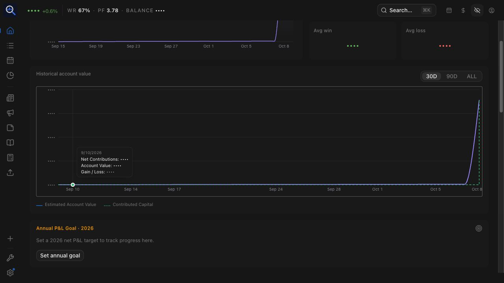
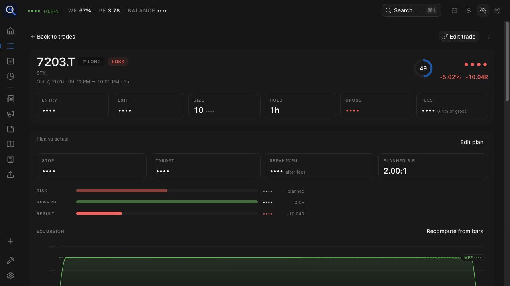

# #269 reactive money masking acceptance

Validated 2026-10-09 against a React Compiler production build. Selective
backport of upstream TraderMemos [#308](https://github.com/sinhong2011/TraderMemos/pull/308)
and [#309](https://github.com/sinhong2011/TraderMemos/pull/309), adapted to TradeLens
i18n and account-value components. No upstream branch merge, API, migration,
accounting, or historical-data change.

## Mechanism and audit

Components obtain money formatters from `useMoneyFormatters()`. Their identities
change with privacy mode, invalidating React Compiler memoized strings and
explicit memo dependencies. Pure helper APIs retain their existing defaults;
UI callers pass the bound formatter. A lint rule rejects raw formatter imports
in app/component code. The obsolete `PrivacyAware` wrapper was removed.

The audit included account value/contributions, SBI execution/settlement displays,
cash ledgers, FX result/fallback, reports, calendar, trade sheets and dialogs,
playbook, replay, annual review, imports, and share-card builders. News/research
surfaces do not call the personal-money formatters. No new translation keys or
dependencies were needed.

## Production browser run

Codex built-in browser, real local API on port 8091, disposable SQLite database.
Synthetic USD/IBKR and JPY/SBI accounts had initial funding and 24 closed trades
with winning/losing days, fees, plans, and a populated setup. The final preview
used standard Vite production preview on port 5194, proxying `/api` to 8091.
Earlier acceptance used the same production assets through a temporary static
proxy; its reload instability was resolved by switching to Vite preview.

| Surface | Exercised result |
| --- | --- |
| Home, account value, contributions, chart ticks | Visible → hidden → visible without reload |
| Account-value tooltip | Keyboard opened; all three money values masked on re-entry; mounted live-flip/currency regression test also passes |
| Reports | Overview, Win/Loss, Detailed, Risk, Behavior all flip both ways; Risk retested after all data loaded |
| Trades and SBI detail | List prices/totals/P&L, detail risk/reward, excursion, execution values/fees flip both ways |
| Calendar | Month/year flip both ways; hidden day drawer and day review; week review closes/reopens with current mode and restores visible values |
| Settings and JPY account | Account balances, P&L, cash ledger, account detail flip both ways |
| Account/currency/language | While hidden: All → JPY account, USD → EUR, English → Chinese → English; amounts stay masked |
| FX dialog | Visible result, hidden re-entry, target currency change, swap; result stays masked |
| Trade and annual share previews | Opt-in amounts remain masked under global privacy; closing/reopening under visible mode restores money; opt-out restores ratio presentation |
| New/edit trade | Computed amounts, saved results, risk and target comparisons obey mode on re-entry; cancel preserves trades; Clear resets new-trade inputs |
| Playbook and annual review | Populated summaries flip both ways |
| Trade replay | Running/paused replay money flips both ways; exit returns to detail |
| Journal import | Estimated P&L and row P&L flip both ways; Back cancels without committing |

[Browser counts](browser-counts.json) supplement direct DOM and screenshot
inspection; they count currency-prefixed rendered amounts, excluding Recharts'
off-screen measurement span. They are not assertions about raw numeric inputs.
The tooltip may close when the header toggle takes focus, so it was explicitly
reopened while hidden.




## Automated checks

- `./node_modules/vite-plus/bin/vp build`: passed, React Compiler enabled.
- `./node_modules/vite-plus/bin/vp check --fix`: passed, zero errors (existing warnings remain).
- `./node_modules/.bin/vitest run --maxWorkers=2`: 184 files, 1050 tests passed.
- `git diff --check`: passed.

Regression tests cover formatter identity and all formatter variants, currency
and locale changes, account-value tooltip, memoized report charts/period returns,
and an opted-in share preview. `web/e2e/privacy.spec.ts` records the repeatable
browser flow. Its Playwright CLI run was not executed; the production browser
acceptance above was driven through Codex's built-in browser.

To run that spec against a disposable production preview with seeded credentials:

```sh
E2E_BASE_URL=http://127.0.0.1:5194 E2E_EMAIL=<test-user> E2E_PASSWORD=<test-password> \
  ./node_modules/.bin/playwright test e2e/privacy.spec.ts
```

## Existing limits and scope

Privacy is a display preference, not data redaction or access control. Editable
money inputs, original CSV source cells, journal-import entry/exit raw numbers,
public FX rates, and existing rule/calculator strings retain their previous
display policy. This change repairs stale strings on existing masked surfaces.
The browser fixture does not establish accounting correctness for SBI settlement
history or every optional account configuration. Public-link transport/export
was not exercised; local share previews were. Mobile was not validated, outside
current fork scope. No deployment, release, tag, or merge was performed.
