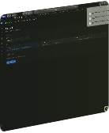

# Issue #103 — TradeLens build and deployment metadata

## Scope and compatibility

- Web package, local source image names, OCI titles, Docker publish display name,
  new Vercel project defaults, APK assets and account export download names use TradeLens.
- Docker publishing also tags legacy `tradermemos-*` repositories. Default upstream
  image pulls remain intact. APK publishing retains `TraderMemos.apk` plus checksum.
- Compose service names/project identity, `tm_data`, database paths, `TM_*` settings,
  API routes, CLI executable, Worker identity, repository URLs and module paths are unchanged.
- PWA name/short name already use TradeLens; no visible PWA change was needed.
- Mobile app identity/display settings remain preserved under the fork's inactive
  mobile policy. Native mobile builds and store submissions are not validated.

## Local verification (2026-09-29)

- `go test ./internal/api ./internal/exporter`: passed.
- Export regression checks assert TradeLens disposition names for CSV, JSON and ZIP.
- `pnpm build`: passed (existing bundle-size/service-worker warnings).
- `pnpm check`: passed, zero errors; 341 existing warnings.
- `pnpm test`: exited 0; existing jsdom `window.scrollTo` diagnostics were emitted.
- Workflow YAML parsed with Ruby's standard YAML parser.
- SQLite and PostgreSQL source Compose configurations parsed successfully.
- API Docker build passed. OCI title reads `TradeLens API`; setup/account read-back
  passed across container restart using the existing `/data/tradermemos.db` default.

## Web end to end

Throwaway API on port 8099 with a fresh SQLite database; first user and Brand QA
account seeded, then AAPL buy 100 at 10 / sell 100 at 12. No production data used.

Codex built-in browser verified login, server-backed account/P&L, export selection,
JSON and CSV requests (HTTP 200). Its download event did not yield a saved path,
so Safari was used to finish actual downloads (Chrome was not connected).

Safari exercised JSON → CSV → ZIP → JSON and read back the selected state.
All three saved downloads used `tradelens-export-brand-qa-2026-09-29` with their
respective extensions. JSON retained format version 1 and one trade; CSV retained
AAPL; ZIP contained valid `export.json` with one trade. Re-entry showed the real
account and default JSON selection. No control semantics were changed; cancel/reset
cases do not apply to the filename-only change.

## External limits

Docker Hub publication and EAS/release uploads are not executed locally; they keep
existing approval/secrets requirements. NAS hardware and native iOS/Android were
not tested. CI status is recorded on the pull request separately.
