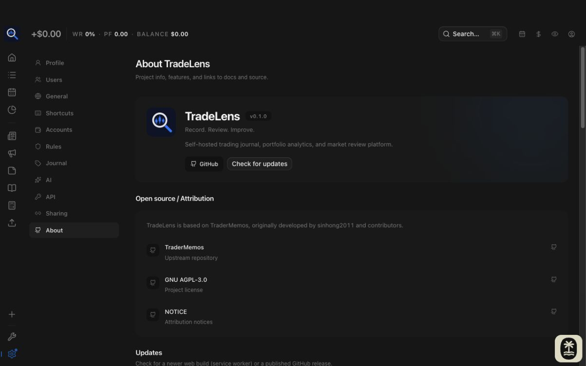
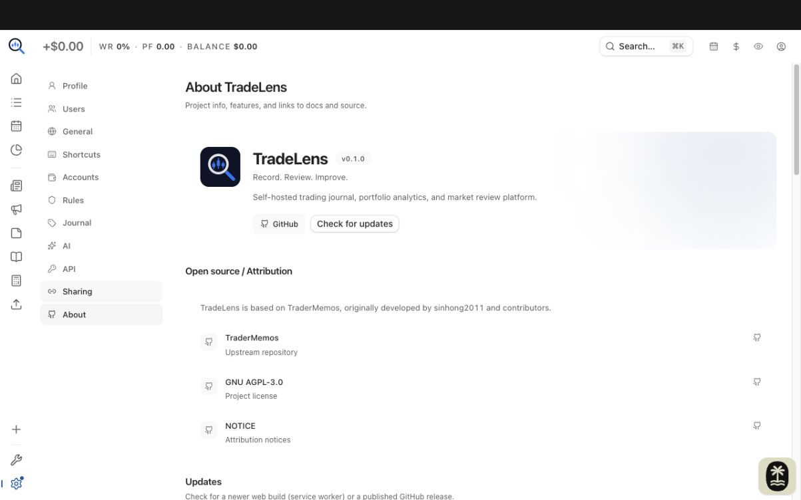
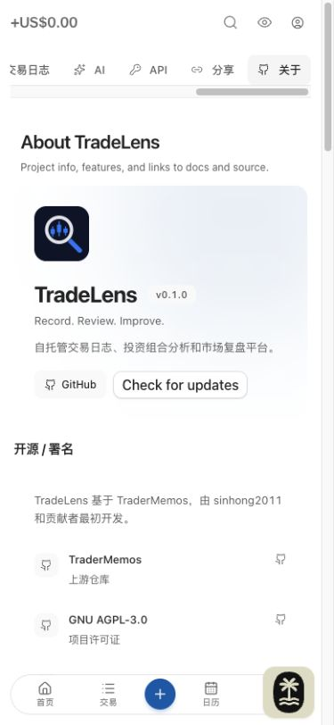
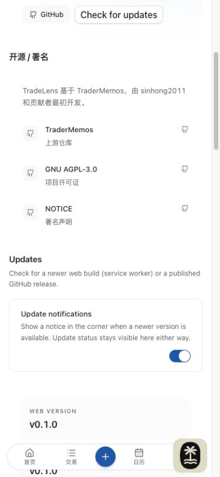

# Issue 191 — TradeLens About and attribution

## Implementation and boundaries

Reuse Settings → About and its existing cards/navigation. Product description and current/upstream repository URLs live in BRAND. The hero and resources link to the TradeLens repository; attribution links to upstream TraderMemos, LICENSE and NOTICE. Original author/contributors are identified explicitly. New attribution labels cover all five existing locales.

Installed Web version/build still comes from the root VERSION and existing Vite build overrides; API version still comes from the connected API. No new version constant. Existing release/update lookup remains upstream-based; changing release metadata belongs to #103. No repository rename (#104), login change, API change or mobile UI change.

## Browser acceptance

Codex built-in browser, local Web on :5191, working API from this checkout on :8191, throwaway SQLite database and QA user/account. The About API section confirmed Connected and the actual API URL/version.

- Reached About through existing Settings navigation; verified TradeLens logo/name, tagline, product description, version and author/contributors.
- Left About for General, changed theme, returned; also reloaded the #about bookmark and confirmed content/read-back.
- Desktop and 390px narrow layouts inspected in light/dark themes. Narrow content wraps; NOTICE is reachable by scrolling. English and Simplified Chinese product/attribution content inspected.
- Activated NOTICE and upstream links and confirmed new tabs with the expected GitHub pages. All four repository/license/NOTICE destinations are covered by the existing Settings component test; GitHub API additionally confirmed LICENSE and NOTICE at the current private repository.
- About adds read-only content and links; no new cancel/reset/filter/toggle state exists.
- Mobile not validated; outside current fork scope. Existing About content outside the new product/attribution copy still falls back to English for zh-CN.

## Local checks

- `pnpm run check`: no errors; existing repository warnings remain.
- `pnpm build`: passed (includes TypeScript).
- `git diff --check`: passed.
- `pnpm test --maxWorkers=2`: 180 files / 1040 tests passed. Initial unrestricted run was affected by a concurrently removed AuthShell test file and two NewTradeDrawer timeouts; the bounded rerun passed all tests.
- CI intentionally skipped per user request with `[skip ci]`; no remote CI pass claimed.

## Screenshots

